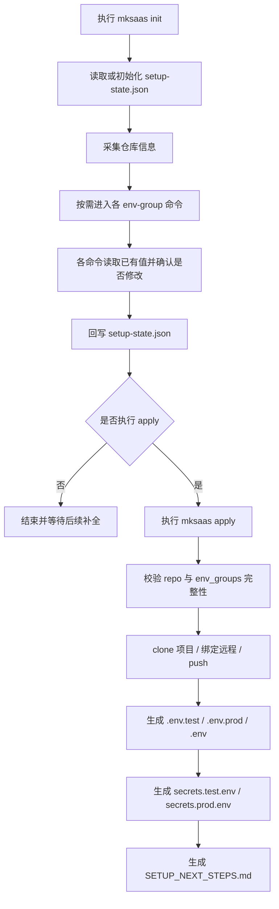
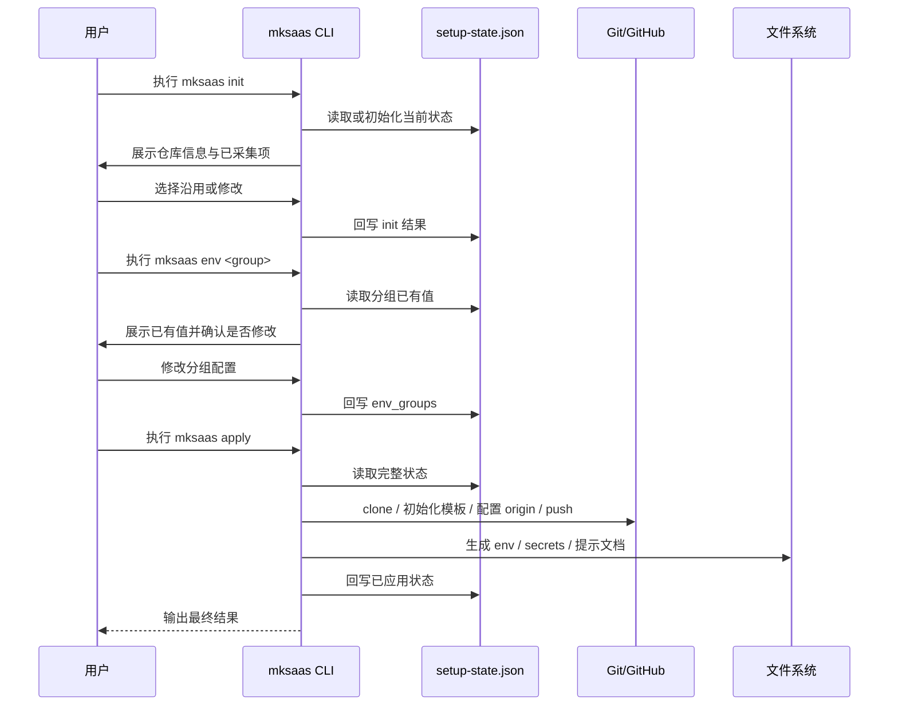

# MkSaaS Python CLI 根需求文档

## 1. 文档定位

本文件是整个项目的根需求文档，只负责描述：

1. 总体目标
2. 总体架构
3. 分步骤文档索引
4. 统一 JSON 状态文件约定
5. 关键流程图与时序图
6. 全局安全与验收标准

详细需求不直接堆在本文件中，而是拆分到每一步的独立文档中。

## 2. 总体目标

本项目需要从零重建为一个纯 Python 实现的命令行工具，不再依赖 shell 脚本作为运行入口。

核心目标：

1. 提供统一的 `mksaas` CLI 命令。
2. 每一步配置都可以单独执行。
3. 每一步执行前都先读取统一 JSON 状态文件。
4. 如果 JSON 中已有信息，CLI 需要先列出已有值并让用户确认是否修改。
5. 每一步修改完成后都回写 JSON 状态文件。
6. 最后由统一的执行步骤根据 JSON 状态文件完成仓库操作与环境文件落地。
7. 敏感信息必须与普通配置分层处理，避免泄露。
8. 后续支持打包为单独可执行文件。

## 3. 总体原则

### 3.1 配置驱动

整个 CLI 采用“先采集配置，后统一生成环境”的模式：

1. 每个步骤只负责收集、校验、更新状态。
2. 状态统一写入一个 JSON 文件。
3. 每个步骤启动时都必须先读取 JSON。
4. 环境文件生成与仓库执行步骤只读取 JSON，不再重复询问。

### 3.2 步骤解耦

每个步骤都必须满足：

1. 可单独运行
2. 可重复运行
3. 可覆盖自己负责的字段
4. 先展示已有值，再由用户决定是否修改
5. 不应破坏其他步骤已写入的状态

### 3.3 交互确认

每个步骤的交互必须遵循以下顺序：

1. 读取 `.mksaas/setup-state.json`
2. 列出当前步骤已存在的配置
3. 询问用户是否沿用
4. 如果用户选择修改，再进入修改流程
5. 修改后立即更新 JSON
6. 提示该步骤尚未真正执行，需在最后一步统一应用

### 3.4 敏感信息分层

状态文件中允许保留完整运行上下文，但敏感信息处理必须有清晰规则：

1. 需求层定义统一 JSON 结构
2. 实现层必须明确哪些字段属于敏感信息
3. 最终生成环境文件时，敏感信息要落到专门的 secrets 文件中

## 4. 分步骤文档索引

`docs/steps/` 只保留两个真正的步骤文档：

1. [01-初始化需求](docs/steps/01-init.md)
2. [02-执行配置需求](docs/steps/02-apply.md)

统一 JSON 示例文件：

1. [setup-state.example.json](docs/setup-state.example.json)

对应步骤命令建议如下：

1. `mksaas init`
2. `mksaas apply`

## 4.1 文档分层原则

为避免重复维护，本项目文档采用分层设计：

1. `REQUIREMENTS.md` 只负责总览、原则、索引和总流程
2. `docs/steps/` 只负责两个顶层步骤：`init` 和 `apply`
3. `docs/env-groups/` 负责具体环境变量分组的字段定义、采集流程、分组命令、校验规则与安全要求
4. `REQUIREMENTS.md` 中的“统一状态文件”章节是状态文件结构的唯一总览来源
5. `docs/steps/02-apply.md` 是最终执行与落地规则的唯一真相来源

具体约束：

1. `docs/steps/` 不重复维护具体变量清单，除非只是做简短索引
2. 变量范围、采集问题、字段校验规则优先写在 `docs/env-groups/`
3. `.env.*`、`secrets.*.env` 的生成与落地策略优先写在 `docs/steps/02-apply.md`
4. 若变量名、provider 或采集逻辑发生变化，应优先更新 `docs/env-groups/`，再检查是否需要同步更新根文档和步骤文档中的索引描述

## 5. 统一状态文件

运行时统一状态文件约定如下：

```text
.mksaas/setup-state.json
```

该文件用途：

1. 记录每一步收集到的配置
2. 记录步骤执行状态
3. 作为最终环境文件生成的唯一输入源
4. 作为重复执行时的默认值来源
5. 记录哪些信息仅已采集、哪些信息已经真正应用到项目

建议的状态模型：

1. `steps` 只保留 `init` 与 `apply`
2. `profiles.<profile>.env_groups` 保存各环境分组字段
3. `modules` 保存 provider、enabled、plans 等抽象配置
4. `artifacts` 保存最终生成文件路径
5. `apply` 保存最近一次执行结果与目标目录

字段对象统一使用以下结构：

1. `value`
2. `sensitive`
3. `source`
4. `description`
5. `required`
6. `generate_if_empty`

## 5.1 环境变量参考分组

参考官方说明：

1. [MkSaaS 环境配置](https://mksaas.com/zh/docs/env)

从官方文档提炼出的统一原则：

1. 以项目根目录的 `.env` 体系作为最终环境落点
2. 以 `env.example` 或 `.env.example` 作为变量来源基线
3. `.env` 文件及其变体不得提交到版本控制
4. 环境变量配置完成后，应支持通过 `pnpm run dev` 验证
5. 各能力的具体参数通常需要先在对应平台完成创建，再回填到 CLI

状态文件与最终环境生成步骤，需要覆盖 MkSaaS 环境模板中的主要变量分组：

1. [Core](docs/env-groups/01-core.md)
2. [Database](docs/env-groups/02-database.md)
3. [Better Auth](docs/env-groups/03-better-auth.md)
4. [GitHub OAuth](docs/env-groups/04-github-oauth.md)
5. [Google OAuth](docs/env-groups/05-google-oauth.md)
6. [Email / Newsletter](docs/env-groups/06-email-newsletter.md)
7. [Storage](docs/env-groups/07-storage.md)
8. [Payment](docs/env-groups/08-payment.md)
9. [Configurations](docs/env-groups/09-configurations.md)
10. [Analytics](docs/env-groups/10-analytics.md)
11. [Notification](docs/env-groups/11-notification.md)
12. [Affiliate](docs/env-groups/12-affiliate.md)
13. [Captcha](docs/env-groups/13-captcha.md)
14. [Crisp](docs/env-groups/14-crisp.md)
15. [Cron Jobs](docs/env-groups/15-cron-jobs.md)
16. [AI](docs/env-groups/16-ai.md)
17. [Firecrawl](docs/env-groups/17-firecrawl.md)

要求：

1. JSON 结构要能稳定映射上述分组
2. 同名环境变量应尽量原样保留，降低生成 `.env` 时的映射复杂度
3. 不得在示例文件中放入真实密钥、真实数据库连接串或真实 webhook 地址
4. 每一个分组都有独立需求文档
5. 每一个分组都必须对应一个可单独执行的 CLI 命令

建议命令如下：

1. `mksaas env core`
2. `mksaas env database`
3. `mksaas env better-auth`
4. `mksaas env github-oauth`
5. `mksaas env google-oauth`
6. `mksaas env email-newsletter`
7. `mksaas env storage`
8. `mksaas env payment`
9. `mksaas env configurations`
10. `mksaas env analytics`
11. `mksaas env notification`
12. `mksaas env affiliate`
13. `mksaas env captcha`
14. `mksaas env crisp`
15. `mksaas env cron-jobs`
16. `mksaas env ai`
17. `mksaas env firecrawl`

## 6. 总体流程图



## 7. 初始化时序图



## 8. 全局文件结构

最终项目需要维护以下文件：

```text
.mksaas/project.yaml
.mksaas/setup-state.json
.mksaas/secrets.test.env
.mksaas/secrets.prod.env
.env.test
.env.prod
.env
SETUP_NEXT_STEPS.md
```

说明：

1. `project.yaml` 用于保存稳定的非敏感项目元信息
2. `setup-state.json` 用于保存步骤状态和配置收集结果
3. `secrets.*.env` 用于保存敏感配置
4. `.env.*` 由统一生成步骤产出
5. Git clone、remote 绑定、push 由最后一步统一执行

## 9. 全局安全要求

### 9.1 敏感信息

以下字段必须视为敏感信息：

1. `DATABASE_URL`
2. 各类 `*_SECRET`
3. 各类 `*_API_KEY`
4. 各类 `TOKEN`
5. 各类 `PASSWORD`
6. 各类 `CLIENT_SECRET`
7. 对象存储的访问密钥

要求：

1. CLI 输出中不得打印完整敏感值
2. 敏感值需要隐藏输入
3. 生成的 secrets 文件尽量限制为当前用户可读写
4. `.gitignore` 必须覆盖 `.env`、`.env.test`、`.env.prod`、`.mksaas/secrets.*.env`

### 9.2 随机数与密钥

要求：

1. `BETTER_AUTH_SECRET` 必须使用 Python 安全随机数生成
2. 不使用弱随机算法
3. 默认长度必须满足现代应用安全要求

### 9.3 Git 与仓库安全

要求：

1. 不自动泄露私有仓库地址中的鉴权信息
2. 不自动输出 token、secret、webhook secret 全量值
3. 不自动创建第三方云资源，避免误操作和权限越界

## 10. 技术约束

1. 使用 Python 3 实现
2. 优先标准库
3. CLI 首版优先 `argparse`
4. 所有代码文件需要函数级注释
5. 实现尽量兼容重复执行
6. 同一命令重复执行时，优先复用 `setup-state.json` 中已有值
7. 每一步命令都必须支持“读取已有值 -> 确认 -> 修改 -> 回写”的统一交互

## 11. 验收标准

满足以下条件视为首版可用：

1. 用户可以通过 `mksaas init` 完成初始化引导
2. 用户可以通过 `mksaas env <group>` 单独执行任一环境分组命令
3. 每个命令执行后都会更新 `.mksaas/setup-state.json`
4. 每个命令再次执行时都会先展示已有 JSON 信息并询问是否修改
5. `mksaas apply` 能根据 JSON 完成 clone、push、`.env` 和 `secrets` 落地
6. 敏感信息不会被直接打印到终端
7. macOS 下可安装为 `mksaas` 命令
8. 不再依赖 shell 脚本作为运行入口
