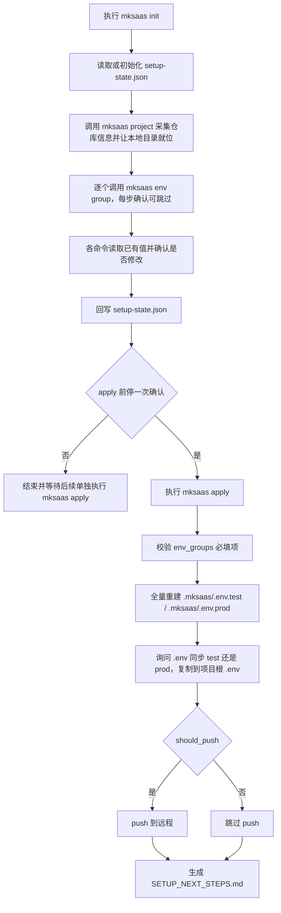
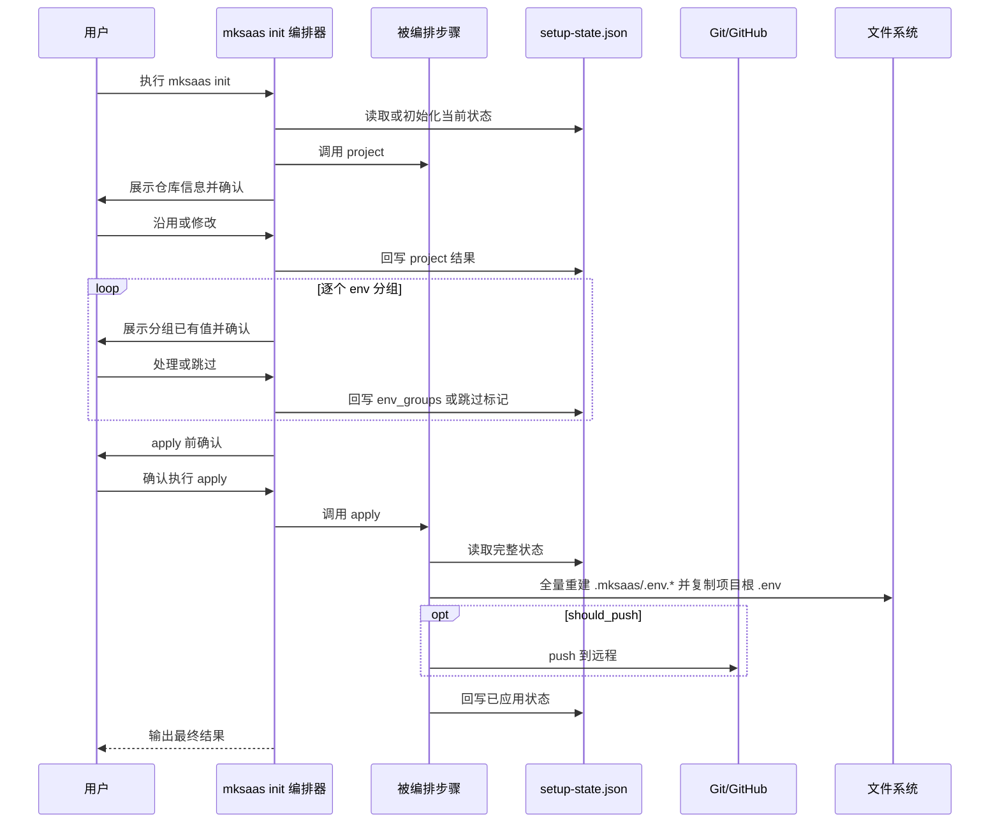

# MkSaaS Python CLI 根需求文档

## 1. 文档定位

本文件是整个项目的根需求文档，只负责描述：

1. 总体目标
2. 总体架构
3. 分步骤文档索引
4. 统一 JSON 状态文件约定
5. 关键流程图与时序图
6. 全局安全与验收标准

详细需求不直接堆在本文件中，而是拆分到每一步的独立文档中。

## 2. 总体目标

本项目需要从零重建为一个纯 Python 实现的命令行工具，不再依赖 shell 脚本作为运行入口。

核心目标：

1. 提供统一的 `mksaas` CLI 命令。
2. 每一步配置都可以单独执行。
3. 每一步执行前都先读取统一 JSON 状态文件。
4. 如果 JSON 中已有信息，CLI 需要先列出已有值并让用户确认是否修改。
5. 每一步修改完成后都回写 JSON 状态文件。
6. 最后由统一的执行步骤根据 JSON 状态文件完成仓库操作与环境文件落地。
7. 终端输出需对密钥、连接串、token 等内容做摘要处理，避免泄露。
8. 后续支持打包为单独可执行文件。

## 3. 总体原则

### 3.1 配置驱动

整个 CLI 采用“先采集配置，后统一生成环境”的模式：

1. 每个步骤只负责收集、校验、更新状态。
2. 状态统一写入一个 JSON 文件。
3. 每个步骤启动时都必须先读取 JSON。
4. 环境文件生成与仓库执行步骤只读取 JSON，不再重复询问。

### 3.2 步骤解耦

每个步骤都必须满足：

1. 可单独运行
2. 可重复运行
3. 可覆盖自己负责的字段
4. 先展示已有值，再由用户决定是否修改
5. 不应破坏其他步骤已写入的状态

### 3.3 交互确认

每个步骤的交互必须遵循以下顺序：

1. 读取 `.mksaas/setup-state.json`
2. 列出当前步骤已存在的配置
3. 询问用户是否沿用
4. 如果用户选择修改，再进入修改流程
5. 修改后立即更新 JSON
6. 提示该步骤尚未真正执行，需在最后一步统一应用

### 3.4 输出脱敏

本项目不再区分敏感与非敏感字段，所有环境变量统一写入 `.env.*`。终端输出时对密钥、连接串、token、webhook 等内容做摘要处理，避免直接打印完整值。

## 4. 分步骤文档索引

`docs/steps/` 只保留两个真正的步骤文档：

1. [01-全流程初始化引导](docs/steps/01-init.md)
2. [02-执行配置需求](docs/steps/02-apply.md)
3. [03-项目信息采集](docs/steps/03-project.md)

统一 JSON 示例文件：

1. [setup-state.example.json](docs/setup-state.example.json)

对应步骤命令建议如下：

1. `mksaas init`：全流程编排器，引导 `project → env×N → apply`
2. `mksaas project`：单独采集项目与仓库信息
3. `mksaas env <group>`：单独采集某一环境分组
4. `mksaas apply`：统一执行落地
5. `mksaas upgrade --local`：从本地构建产物升级已安装的 `mksaas`
6. `mksaas uninstall`：卸载本地安装的 `mksaas`

安装与构建脚本（位于仓库根目录）：

1. `install.sh`：把 `mksaas` 安装到本地固定目录并建立命令符号链接
2. `build.sh`：用 PyInstaller 构建单文件二进制产物，输出到本地固定目录

构建、安装、升级与卸载的完整规则见：[build_install_upgrade_uninstall.md](docs/build_install_upgrade_uninstall.md)

## 4.1 文档分层原则

为避免重复维护，本项目文档采用分层设计：

1. `REQUIREMENTS.md` 只负责总览、原则、索引和总流程
2. `docs/steps/` 负责三个顶层步骤：`init`（编排）、`project`（项目采集）、`apply`（落地）
3. `docs/env-groups/` 负责具体环境变量分组的字段定义、采集流程、分组命令、校验规则与安全要求
4. `docs/build_install_upgrade_uninstall.md` 负责构建、安装、升级与卸载的完整规则
5. `REQUIREMENTS.md` 中的“统一状态文件”章节是状态文件结构的唯一总览来源
6. `docs/steps/02-apply.md` 是最终执行与落地规则的唯一真相来源
7. `docs/build_install_upgrade_uninstall.md` 是构建/安装/升级/卸载规则的唯一真相来源

具体约束：

1. `docs/steps/` 不重复维护具体变量清单，除非只是做简短索引
2. 变量范围、采集问题、字段校验规则优先写在 `docs/env-groups/`
3. `.env.*` 的生成与落地策略优先写在 `docs/steps/02-apply.md`
4. 若变量名、provider 或采集逻辑发生变化，应优先更新 `docs/env-groups/`，再检查是否需要同步更新根文档和步骤文档中的索引描述

## 5. 统一状态文件

运行时统一状态文件约定如下：

```text
.mksaas/setup-state.json
```

该文件用途：

1. 记录每一步收集到的配置
2. 记录步骤执行状态
3. 作为最终环境文件生成的唯一输入源
4. 作为重复执行时的默认值来源
5. 记录哪些信息仅已采集、哪些信息已经真正应用到项目

建议的状态模型：

1. `steps` 包含 `init`（编排进度）、`project`（项目采集）、`apply`（落地执行）
2. `profiles.<profile>.env_groups` 保存各环境分组字段
3. `modules` 保存 provider、enabled、plans 等抽象配置
4. `artifacts` 保存最终生成文件路径
5. `apply` 保存最近一次执行结果与目标目录

字段对象统一使用以下结构：

1. `value`
2. `source`
3. `description`
4. `required`
5. `generate_if_empty`

说明：

1. 不再区分敏感与非敏感字段，所有环境变量统一写入 `.env.*` 文件
2. 不再生成 `secrets.*.env` 文件
3. 终端输出时仍应避免直接打印完整密钥、连接串、token 等内容，以摘要形式展示

### 5.2 环境分组标识符规范

为保证 CLI 命令名、状态文件 group key、文档文件名三者一一对应且不产生歧义，统一约定如下：

1. 每个 env 分组有唯一的规范标识符（`id`），采用下划线小写形式，例如 `github_oauth`、`cron_jobs`、`better_auth`
2. `id` 即为状态文件 `profiles.<profile>.env_groups` 下的 group key，以及 `steps.init.env_groups_processed/skipped` 列表中的元素
3. CLI 命令中的 group 参数使用连字符形式（`github-oauth`、`cron-jobs`、`better-auth`），CLI 内部负责连字符 ↔ 下划线的双向映射
4. `docs/env-groups/` 文件名采用 `<序号>-<连字符形式>.md`，序号仅用于文档排序，不参与运行时映射
5. CLI 与 apply 遍历分组的顺序固定为 `01~17` 的文档序号顺序，与 group key 的字母序无关
6. 状态文件中只允许出现规范 group key，禁止混用连字符形式

完整映射表见 `docs/env-groups/` 各文档与 §5.1 的分组清单。

### 5.2.1 变量全集 schema

为支撑 apply 的全量重建（§10），CLI 维护一份独立的变量全集 schema 文件 `docs/env-schema.yaml`，作为环境变量的唯一真相来源：

1. schema 文件以 group 为单位组织，每个 group 列出其全部变量、`required`、默认值、`generate_if_empty`、脱敏类型
2. CLI 在运行时加载该 schema；env 命令采集的字段、apply 重建 `.env.*` 的变量全集，均以该 schema 为准
3. env-group 文档（`docs/env-groups/*.md`）描述采集流程与校验规则，变量清单以 schema 为准；两者冲突时以 schema 为准
4. apply 全量重建 `.env.test` / `.env.prod` 时，按 schema 遍历全部变量：已采集的取状态文件值，未采集或跳过的取 schema 默认值（无默认值且非必填则写空串，必填且缺失则在 §10 校验阶段拦截）
5. schema 变更时同步更新 env-group 文档，避免两处分叉

## 5.1 环境变量参考分组

参考官方说明：

1. [MkSaaS 环境配置](https://mksaas.com/zh/docs/env)

从官方文档提炼出的统一原则：

1. 以项目根目录的 `.env` 体系作为最终环境落点
2. 以 `env.example` 或 `.env.example` 作为变量来源基线
3. `.env`、`.env.test`、`.env.prod` 与整个 `.mksaas/` 目录都不能提交到版本控制
4. 环境变量配置完成后，应支持通过 `pnpm run dev` 验证
5. 各能力的具体参数通常需要先在对应平台完成创建，再回填到 CLI

状态文件与最终环境生成步骤，需要覆盖 MkSaaS 环境模板中的主要变量分组：

1. [Core](docs/env-groups/01-core.md)
2. [Database](docs/env-groups/02-database.md)
3. [Better Auth](docs/env-groups/03-better-auth.md)
4. [GitHub OAuth](docs/env-groups/04-github-oauth.md)
5. [Google OAuth](docs/env-groups/05-google-oauth.md)
6. [Email / Newsletter](docs/env-groups/06-email-newsletter.md)
7. [Storage](docs/env-groups/07-storage.md)
8. [Payment](docs/env-groups/08-payment.md)
9. [Configurations](docs/env-groups/09-configurations.md)
10. [Analytics](docs/env-groups/10-analytics.md)
11. [Notification](docs/env-groups/11-notification.md)
12. [Affiliate](docs/env-groups/12-affiliate.md)
13. [Captcha](docs/env-groups/13-captcha.md)
14. [Crisp](docs/env-groups/14-crisp.md)
15. [Cron Jobs](docs/env-groups/15-cron-jobs.md)
16. [AI](docs/env-groups/16-ai.md)
17. [Firecrawl](docs/env-groups/17-firecrawl.md)

要求：

1. JSON 结构要能稳定映射上述分组
2. 同名环境变量应尽量原样保留，降低生成 `.env` 时的映射复杂度
3. 不得在示例文件中放入真实密钥、真实数据库连接串或真实 webhook 地址
4. 每一个分组都有独立需求文档
5. 每一个分组都必须对应一个可单独执行的 CLI 命令

建议命令如下：

1. `mksaas env core [--profile test|prod]`
2. `mksaas env database [--profile test|prod]`
3. `mksaas env better-auth [--profile test|prod]`
4. `mksaas env github-oauth [--profile test|prod]`
5. `mksaas env google-oauth [--profile test|prod]`
6. `mksaas env email-newsletter [--profile test|prod]`
7. `mksaas env storage [--profile test|prod]`
8. `mksaas env payment [--profile test|prod]`
9. `mksaas env configurations [--profile test|prod]`
10. `mksaas env analytics [--profile test|prod]`
11. `mksaas env notification [--profile test|prod]`
12. `mksaas env affiliate [--profile test|prod]`
13. `mksaas env captcha [--profile test|prod]`
14. `mksaas env crisp [--profile test|prod]`
15. `mksaas env cron-jobs [--profile test|prod]`
16. `mksaas env ai [--profile test|prod]`
17. `mksaas env firecrawl [--profile test|prod]`

`--profile` 规则：

1. `--profile test` 表示本次采集写入 `profiles.test`
2. `--profile prod` 表示本次采集写入 `profiles.prod`
3. 缺省时优先按 `test` 处理，或提示用户选择
4. `apply` 阶段会同时基于 `profiles.test` 与 `profiles.prod` 全量重建 `.env.test` 与 `.env.prod`，随后询问用户 `.env` 同步 test 还是 prod，再删除重建 `.env`

## 6. 总体流程图

`mksaas init` 作为编排器，引导 `project → env×N → apply`：



逐步流程（不走 init）同样可达：任意单个或多个 `mksaas env <group>` 即可 `mksaas apply`，`project` 可选，无需采集全部分组。

逐步模式的前置约束：

1. 逐步模式下，`mksaas env <group>` 与 `mksaas apply` 启动时必须先定位到 `.mksaas/setup-state.json`
2. 该状态文件只能由 `mksaas project` 创建；因此逐步模式要求用户**当前工作目录已是 `mksaas project` 就位过的项目目录**（即当前目录或其直接子层存在 `.mksaas/setup-state.json`）
3. 若状态文件不存在，逐步命令应明确提示用户先执行 `mksaas project` 完成项目就位，不得自行创建 `.mksaas/` 或状态文件
4. 当未采集 `project` 时，apply 跳过 push，仅生成 `.env.*`，要求当前目录已是有效项目；apply 只校验环境必填项

## 7. 初始化时序图



## 8. 全局文件结构

`.mksaas/` 状态目录位于本地项目目录内（即 git 仓库根目录内），由 `mksaas project` 创建。最终项目需要维护以下文件：

```text
tourismchina/                  ← 本地项目目录 = git 仓库根目录
├── .mksaas/                   ← 状态目录，gitignore
│   ├── setup-state.json       ← 步骤状态与配置收集结果
│   ├── .env.test              ← test 环境变量（apply 全量重建）
│   └── .env.prod              ← prod 环境变量（apply 全量重建）
├── .env                       ← 本地开发用，apply 时从 .mksaas/.env.<profile> 复制
└── SETUP_NEXT_STEPS.md
```

说明：

1. `setup-state.json` 用于保存步骤状态、配置收集结果与项目元信息（`project` 块）
2. `.env.test`、`.env.prod` 落点为 `.mksaas/`，由 apply 全量重建，包含全部环境变量，不再单独生成 secrets 文件
3. `.env` 落点为项目代码根目录，供 `pnpm run dev` 等工具链读取，内容由 apply 时用户选择的 profile 复制而来
4. `.mksaas/` 整个目录不纳入版本控制
5. 本地项目目录就位（clone、模板初始化、建空目录）由 `mksaas project` 完成；push 由 `mksaas apply` 完成

## 9. 全局安全要求

### 9.1 环境文件保护

本项目不再区分敏感与非敏感字段，所有环境变量统一写入 `.env.*`，因此 `.env` 文件本身的保护尤为重要。

要求：

1. `.gitignore` 必须覆盖整个 `.mksaas/` 目录以及项目根 `.env`
2. CLI 输出中不得打印完整密钥、连接串、token 等内容，以摘要形式展示
3. 采集敏感字段（密钥、token、密码、webhook 等）时使用隐藏输入
4. 不再单独生成 `secrets.*.env` 文件

### 9.2 随机数与密钥

要求：

1. `BETTER_AUTH_SECRET` 必须使用 Python 安全随机数生成
2. 不使用弱随机算法
3. 默认长度必须满足现代应用安全要求

### 9.3 Git 与仓库安全

要求：

1. 状态文件中的 `project.repo_url` 只存**干净 URL**（如 `https://github.com/owner/repo.git` 或 `git@github.com:owner/repo.git`），**不得存带 `user:token@` 鉴权段的 URL**
2. clone/push 所需的鉴权完全由用户本地环境提供：用户须自行完成 SSH key 配置或 HTTPS 凭据转发（如 `gh auth login`、git credential helper、SSH agent forwarding）。CLI 不内置任何凭据获取、存储或注入逻辑
3. CLI 不自动创建 GitHub 仓库、不自动创建第三方云资源，避免误操作和权限越界
4. 任何输出 `repo_url` 的地方按干净 URL 展示；若用户误输入带鉴权段的 URL，CLI 应在落盘前剥离鉴权段并提示
5. 不自动输出 token、secret、webhook secret 全量值

## 10. 技术约束

1. 使用 Python 3 实现
2. 优先标准库
3. CLI 首版优先 `argparse`
4. 所有代码文件需要函数级注释
5. 实现尽量兼容重复执行
6. 同一命令重复执行时，优先复用 `setup-state.json` 中已有值
7. 每一步命令都必须支持“读取已有值 -> 确认 -> 修改 -> 回写”的统一交互
8. `install.sh`、`build.sh`、`mksaas upgrade --local`、`mksaas uninstall` 共同约定一组固定本地路径（见 §12），各脚本与命令必须读写同一组路径，不得各自硬编码不同位置

## 11. 验收标准

满足以下条件视为首版可用：

1. 用户可以通过 `mksaas init` 完成全流程引导（project → env×N → apply，每步确认，env 可跳过，apply 前停确认）
2. 用户可以通过 `mksaas project` 单独采集项目与仓库信息
3. 用户可以通过 `mksaas env <group>` 单独执行任一环境分组命令（逐步模式下要求当前目录已是 `project` 就位过的项目目录）
4. 每个命令执行后都会更新 `.mksaas/setup-state.json`
5. 每个命令再次执行时都会先展示已有 JSON 信息并询问是否修改
6. `mksaas apply` 启动时必须保证 `project` 信息已存在，否则终止并提示先执行 `mksaas project`；其后根据 JSON 完成 `.env.test`/`.env.prod`/`.env` 落地，并在 `should_push` 为真时 push（clone 与模板初始化由 `mksaas project` 完成）
7. 密钥、连接串、token 等内容不会被直接打印到终端
8. macOS 下可通过 `install.sh` 安装为 `mksaas` 命令，可通过 `mksaas upgrade --local` 升级，可通过 `mksaas uninstall` 卸载
9. 不再依赖 shell 脚本作为运行入口（`install.sh` / `build.sh` 仅用于安装与构建，不是 CLI 的运行入口）

## 12. 构建、安装、升级与卸载

构建、安装、升级与卸载的完整规则见独立文档：[build_install_upgrade_uninstall.md](docs/build_install_upgrade_uninstall.md)。

本节仅保留总览：

1. 仓库根提供 `install.sh`（本地目录 + 符号链接安装）与 `build.sh`（PyInstaller 单文件二进制构建）
2. `mksaas upgrade --local` 从本地构建产物升级；`mksaas uninstall` 卸载本地安装
3. 版本号由仓库根 `VERSION` 文件的 `version`（`MAJOR.MINOR.PATCH`）与 `build`（整数）两个字段驱动；debug 产物为 `<version>-dev<build>`，release 产物为 `<version>`；产物落 `dist/<版本字符串>/mksaas`
4. `build.sh --bump` 提升版本号并重置 `build=1`，默认 `PATCH+1`，可选 `--minor` / `--major` 指定位级
5. 命令符号链接 PATH 优先级：`/usr/local/bin` 优先，不可写时回退 `~/.local/bin`
6. 四个组件共享同一组固定本地路径，不得各自硬编码不同位置
