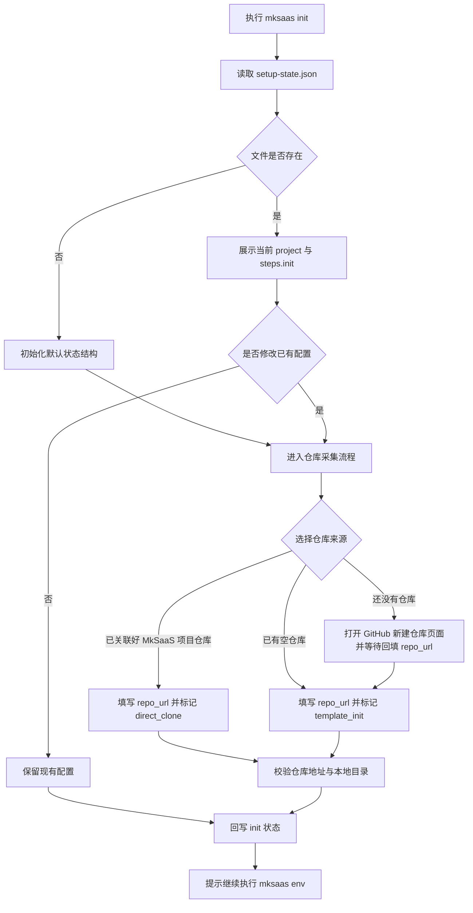
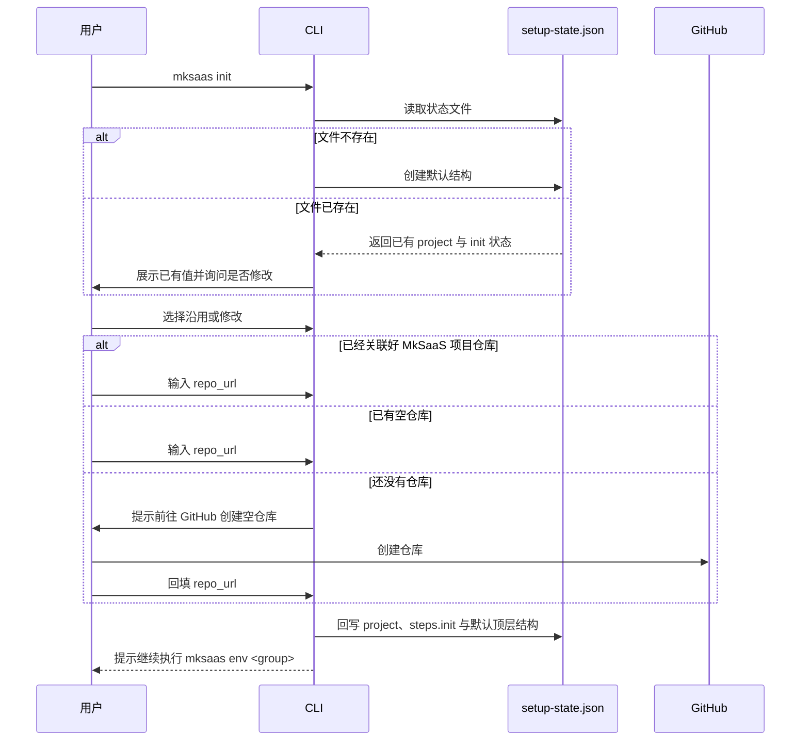

# 步骤 01：初始化需求

## 1. 目标

本步骤是唯一的初始化入口，负责建立 `.mksaas/setup-state.json`，并完成仓库与项目级基础信息的首次采集。

说明：

1. `init` 负责初始化状态文件与仓库配置
2. `init` 不直接执行 clone、remote 绑定或 push
3. 具体环境变量采集通过 `mksaas env <group> [--profile test|prod]` 完成，`--profile` 决定本次写入 `profiles.test` 还是 `profiles.prod`
4. 真正的 Git 操作和环境落地在 `apply` 阶段统一执行

## 2. 独立命令

```bash
mksaas init
```

要求：

1. 该命令可重复执行
2. 启动时先读取 `.mksaas/setup-state.json`
3. 若已有仓库与项目信息，先展示并让用户确认是否修改
4. 若状态文件不存在，则初始化默认结构
5. 修改完成后立即回写 JSON

## 3. 负责范围

`init` 负责以下内容：

1. 初始化 `.mksaas/setup-state.json`
2. 采集仓库来源与 `repo_url`
3. 采集 `project_dir`、`template_repo`、`template_branch`
4. 初始化 `steps.init` 与 `steps.apply` 状态
5. 初始化 `profiles`、`modules`、`artifacts` 顶层结构

## 4. 输入

用户输入信息：

1. 仓库来源
2. `repo_url`
3. 可选的本地目录
4. 可选的模板仓库地址
5. 可选的模板分支

执行前输入来源：

1. `.mksaas/setup-state.json`

## 5. 流程图



## 6. 时序图



## 7. 仓库来源

CLI 需要支持以下三类仓库来源：

1. 已经关联好 MkSaaS 项目仓库
2. 已有空仓库
3. 还没有仓库

## 8. 行为要求

### 8.1 通用交互

要求：

1. 启动时先读取 `.mksaas/setup-state.json`
2. 如果当前步骤已有配置，先列出已有值
3. 询问用户是否沿用已有配置
4. 如果用户选择修改，再进入输入流程
5. 修改后立即回写 JSON
6. 提示用户继续通过 `mksaas env <group> [--profile test|prod]` 补全环境配置

### 8.2 已经关联好 MkSaaS 项目仓库

要求：

1. 询问 `repo_url`
2. 根据 `repo_url` 推导默认本地目录名
3. 标记最终执行时采用直接 clone 策略
4. 不重新初始化模板

### 8.3 已有空仓库

要求：

1. 询问 `repo_url`
2. 记录最终执行时要从 MkSaaS 模板初始化
3. 记录模板远程名称为 `template`
4. 记录目标远程名称为 `origin`
5. 标记最终执行时需要 push

### 8.4 还没有仓库

要求：

1. 打开 `https://github.com/new`
2. 提示用户创建空私仓
3. 用户创建完成后输入 `repo_url`
4. 然后记录为空仓库初始化策略

## 9. 输出

本步骤结束后，必须在 JSON 状态文件中写入以下信息：

1. 仓库类型
2. `repo_url`
3. `repo_name`
4. `project_dir`
5. `template_repo`
6. `template_branch`
7. `apply_strategy`
8. `should_push`
9. `steps.init`
10. `steps.apply`

## 10. 异常处理

需要处理以下异常：

1. 本地目录已存在
2. `repo_url` 为空
3. JSON 文件损坏或字段不合法
4. 用户拒绝确认已有配置
5. 仓库地址格式错误

## 11. 安全要求

1. 不在日志中泄露带鉴权信息的仓库地址
2. 不自动创建 GitHub 仓库
3. 出错时给出明确中文提示
