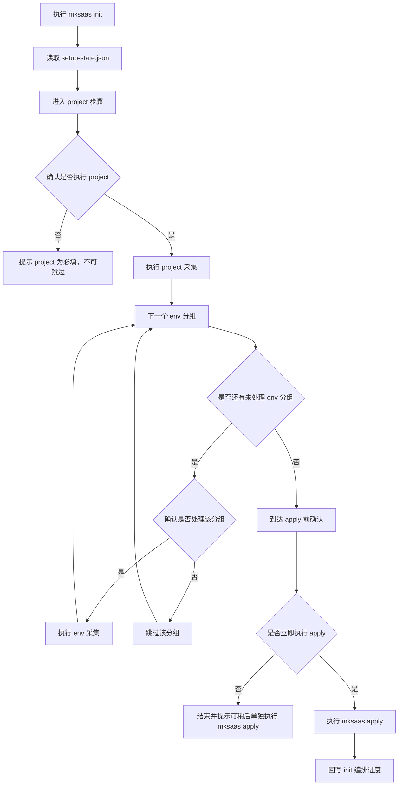
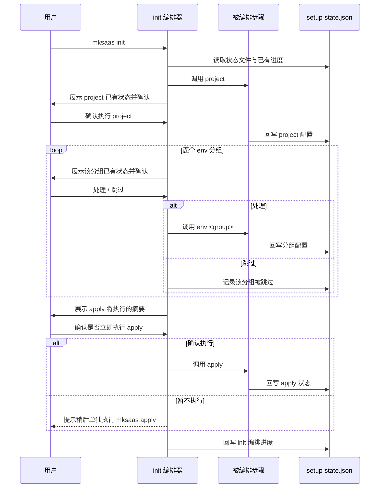

# 步骤 01：全流程初始化引导

## 1. 目标

本步骤是全流程初始化入口，作为编排器引导用户跑完完整流程。它本身不直接采集具体配置，而是按顺序串联 `project` → `env <group>` × N → `apply`，每一步都先确认、可选择跳过，apply 前停一次确认。

说明：

1. `init` 是全流程编排器，按 `project → env1 → env2 → … → envX → apply` 顺序引导
2. `init` 本身不直接执行 clone、remote 绑定、push 或环境落地，这些由被编排的步骤完成
3. 每进入一个被编排步骤前，都先展示该步骤已有状态并让用户确认是否继续
4. 用户可在任意一个 `env` 步骤选择跳过，不影响后续步骤
5. 到达 `apply` 前，必须单独停一次让用户确认是否立即执行

## 2. 独立命令

```bash
mksaas init
```

要求：

1. 该命令可重复执行，重复执行时按已有进度继续引导
2. 启动时先读取 `.mksaas/setup-state.json`
3. 若状态文件不存在，由第一个被编排步骤 `project` 负责初始化
4. 全流程不强制一次跑完，可中途退出，下次再执行时从断点继续

## 3. 编排范围

`init` 按以下顺序编排：

1. `mksaas project`：初始化状态文件 + 采集仓库与项目信息
2. `mksaas env <group> [--profile test|prod]`：逐个采集环境分组，每个分组都可确认或跳过
3. `mksaas apply`：统一执行落地，apply 前停一次确认

被编排的 env 分组顺序与 `docs/env-groups/01~17` 一致，用户可跳过任意分组。

## 4. 两种使用方式

1. 完整流程：`mksaas init`，由编排器引导 `project → env×N → apply`
2. 逐步流程：用户也可不走 `init`，直接单步执行 `mksaas env <group>`、`mksaas apply`，`project` 可选

逐步模式下，任意单个或多个 `env <group>` 即可搭配 `apply`，`project` 可选，无需采集全部分组，也无需走完整 `init`。当未采集 `project` 时，apply 跳过 clone/remote/push，仅生成 `.env.*`，要求当前目录已是有效项目。apply 只校验环境必填项是否齐全。

两种方式共享同一个 `.mksaas/setup-state.json`，状态互通。

## 5. 流程图



## 6. 时序图



## 7. 步骤确认规则

要求：

1. 每进入一个被编排步骤前，先展示该步骤在 JSON 中的已有状态
2. `project` 为必填步骤，不可跳过；若用户拒绝，则终止本次编排
3. 每个 `env` 分组都可选择处理或跳过，跳过不影响后续分组
4. 到达 `apply` 前，单独停一次确认，apply 摘要中不得展示完整密钥、连接串、token
5. 用户选择暂不执行 apply 时，编排正常结束并提示可稍后单独执行 `mksaas apply`

## 8. 编排进度记录

`init` 在 JSON 中通过 `steps.init` 记录编排进度：

1. 已处理或跳过的 env 分组列表
2. 是否已到达 apply 确认环节
3. 是否已执行 apply
4. 最近一次更新时间

进度记录用于支持"中途退出、下次续跑"。

## 9. 输出

本步骤结束后，JSON 状态文件中应包含：

1. `steps.project`：由 `project` 步骤回写
2. `profiles.<profile>.env_groups`：由各 `env` 步骤回写
3. `steps.init`：编排进度
4. `steps.apply`：若已执行 apply，由 apply 步骤回写

## 10. 异常处理

需要处理以下异常：

1. 被编排步骤自身抛出的异常（沿用各步骤的异常处理）
2. JSON 文件损坏或字段不合法
3. 用户中途退出，需保证已采集的步骤状态已回写
4. apply 前确认被拒绝，需正常结束并保留进度

## 11. 安全要求

1. 编排过程中不在日志泄露带鉴权信息的仓库地址
2. apply 摘要中不得展示完整密钥、连接串、token、webhook
3. 出错时给出明确中文提示
