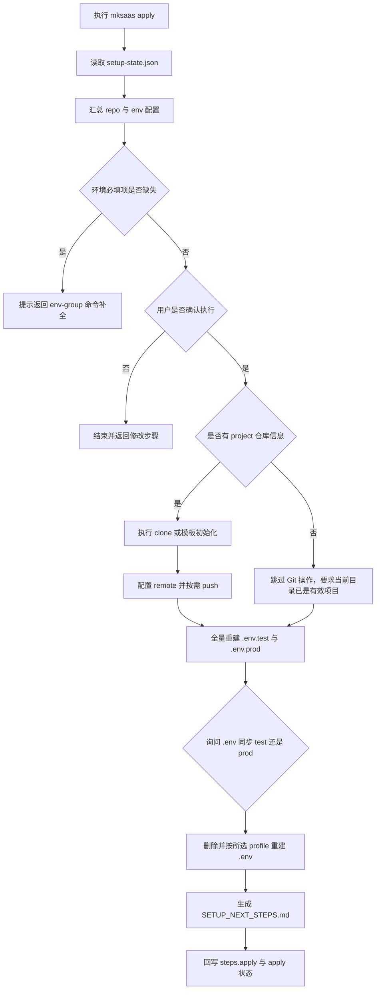
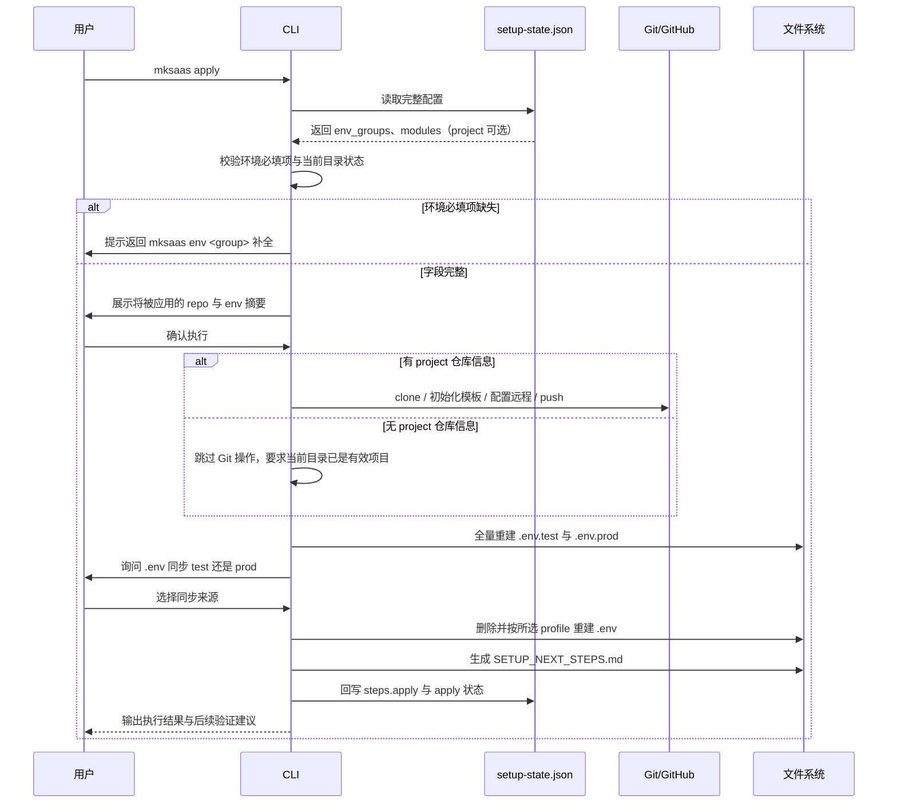

# 步骤 02：执行配置需求

## 1. 目标

本步骤是最后一步，负责把 `.mksaas/setup-state.json` 中已经确认好的配置真正应用到项目与仓库。

本步骤负责：

1. 根据仓库策略执行 clone 或模板初始化（仅当存在 `project` 仓库信息时）
2. 绑定远程并按需 push（仅当存在 `project` 仓库信息时）
3. 读取 JSON 中的环境信息并写入项目 `.env.*`
4. 生成 `SETUP_NEXT_STEPS.md`
5. 回写 `steps.apply` 和最终应用状态

## 2. 独立命令

```bash
mksaas apply
```

要求：

1. 该命令是最终统一执行命令
2. 启动时先读取完整 `.mksaas/setup-state.json`
3. 执行前先汇总展示将被应用的仓库与环境配置
4. 用户确认后才执行真实写入和 Git 操作

## 3. 前置依赖

`apply` 依赖以下信息已经在 JSON 中存在：

1. `profiles.<profile>.env_groups` 中的环境分组信息
2. `modules` 中的 provider 和启用状态
3. `project` 中的仓库信息（可选，缺失时跳过 Git 操作）

说明：

1. `apply` 不再向用户重复询问已经存在于 JSON 的信息
2. 若发现环境必填项缺失，应提示用户返回 `mksaas env <group>` 补全
3. 逐步模式下，用户可任意搭配：任意单个或多个 `mksaas env <group>` 即可直接 `mksaas apply`，`project` 可选，无需走完整 `init` 流程，也无需采集全部分组
4. apply 只校验环境必填项是否齐全，不强制要求所有 env 分组都已采集，也不强制要求 `project` 已采集
5. 当 JSON 中无 `project` 仓库信息（或本地目录已是有效仓库）时，apply 跳过 clone、remote 绑定、push，仅生成 `.env.*`，此时要求当前目录或指定目录已是有效项目

## 4. 流程图



## 5. 时序图



## 6. 输入

输入来源：

1. `.mksaas/setup-state.json`
2. 当前本地目录状态
3. 项目模板文件

## 7. 执行前交互

要求：

1. 启动时先读取完整 JSON
2. 汇总展示将要应用的仓库配置和环境配置
3. 询问用户是否立即执行
4. 如果用户选择返回修改，应允许退出并回到对应命令

## 8. 执行顺序

建议执行顺序：

1. 校验环境必填项
2. 准备本地项目目录
3. 若存在 `project` 仓库信息：执行 clone 或模板初始化
4. 若存在 `project` 仓库信息：配置 Git remote
5. 若存在 `project` 仓库信息：按需 push 到远程
6. 若无 `project` 仓库信息：跳过 3~5，要求当前目录已是有效项目
7. 全量重建 `.env.test` 与 `.env.prod`
8. 询问用户 `.env` 同步 `test` 还是 `prod`，删除并按所选 profile 重建 `.env`
9. 生成 `SETUP_NEXT_STEPS.md`
10. 回写 `setup-state.json` 的 `steps.apply` 和 `apply` 状态

## 9. 仓库执行规则

本节规则仅当 JSON 中存在 `project` 仓库信息时适用；若无 `project` 信息，apply 跳过全部 Git 操作，要求当前目录已是有效项目，仅做环境文件落地。

### 9.1 已有关联好项目仓库

要求：

1. 直接 clone
2. 不覆盖已有本地目录
3. clone 成功后回写本地路径

### 9.2 已有空仓库

要求：

1. 从模板初始化本地目录
2. 保留模板远程为 `template`
3. 将用户仓库设置为 `origin`
4. 根据配置执行首次 push

### 9.3 还没有仓库

要求：

1. 若 `repo_url` 仍为空，则跳过 Git 操作，进入纯环境落地模式
2. 提示用户可回到 `mksaas project` 补全仓库信息后再执行带 Git 操作的 apply

## 10. 环境落地规则

要求：

1. 从 JSON 的 `profiles.<profile>.env_groups` 读取环境变量
2. 本项目不再区分敏感与非敏感字段，所有环境变量统一写入 `.env.*`，不再单独生成 secrets 文件
3. 每次执行都对 `.env.test` 与 `.env.prod` 做全量重建（先删除再创建），保证内容与 JSON 一致、不留旧变量
4. `.env` 不直接对应某个 profile，其内容由用户在 apply 时选择同步来源（`test` 或 `prod`）后，删除并按所选 profile 重建，因此 `.env` 本次可能代表 test、下次可能代表 prod
5. 若字段支持自动生成且为空，应在此步骤生成后再落盘
6. 具体字段清单与采集规则以 `docs/env-groups/*.md` 为准

profile 与文件映射：

1. `profiles.test` → `.env.test`
2. `profiles.prod` → `.env.prod`
3. 用户在 apply 时选择的同步来源 → `.env`

## 11. 回写规则

本步骤执行完成后必须回写：

1. `steps.apply.status`
2. `steps.apply.updated_at`
3. `steps.apply.applied`
4. `steps.apply.applied_at`
5. `apply.last_run_at`
6. `apply.last_result`
7. `apply.last_applied_project_dir`

## 12. 异常处理

需要处理以下情况：

1. JSON 文件不存在
2. JSON 字段缺失
3. 本地目录冲突
4. Git clone 失败
5. Git push 失败
6. `.env` 输出目录不可写
7. 必填字段缺失

## 13. 安全要求

1. 执行前摘要中不得展示完整密钥、连接串、token、webhook 等内容
2. 终端日志不得输出 token、secret、password 全量内容
3. 不再单独生成 secrets 文件，所有变量统一写入 `.env.*`
4. `.gitignore` 必须覆盖整个 `.mksaas/` 目录以及 `.env`、`.env.test`、`.env.prod`
