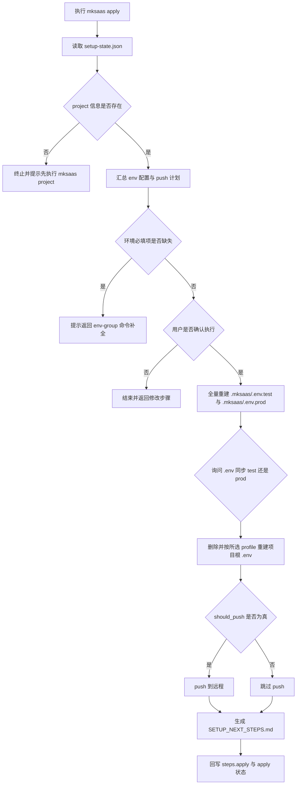
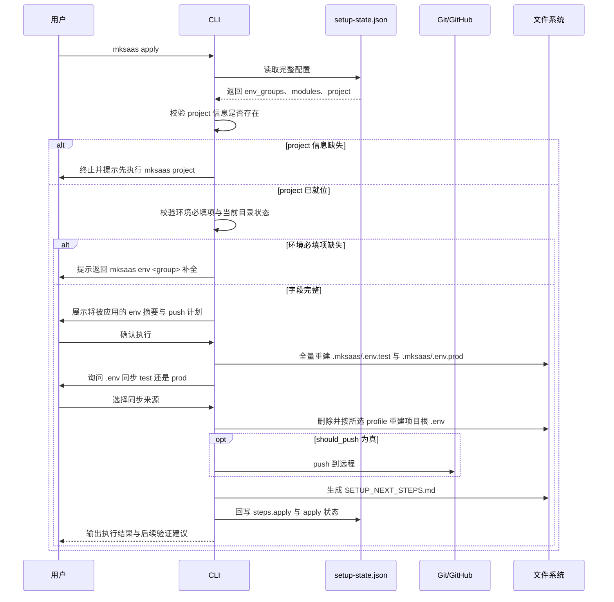

# 步骤 02：执行配置需求

## 1. 目标

本步骤是最后一步，负责把 `.mksaas/setup-state.json` 中已经确认好的配置真正应用到项目：生成环境文件、按需 push 到远程。

本步骤负责：

1. 全量重建 `.env.test` 与 `.env.prod`（落点为 `.mksaas/`）
2. 询问用户 `.env` 同步来源，复制为项目代码根目录的 `.env`
3. 按需 push 到远程（仅当存在 `project` 仓库信息且 `should_push` 为真时）
4. 生成 `SETUP_NEXT_STEPS.md`
5. 回写 `steps.apply` 和最终应用状态

说明：

1. 本地项目目录的就位（clone、模板初始化、建空目录）已在 `mksaas project` 完成，apply 不再执行 clone 或模板初始化
2. apply 只在本地项目目录内生成环境文件并按需 push

## 2. 独立命令

```bash
mksaas apply
```

要求：

1. 该命令是最终统一执行命令
2. 启动时先读取完整 `.mksaas/setup-state.json`
3. 执行前先汇总展示将被应用的环境配置与 push 计划
4. 用户确认后才执行真实写入和 Git 操作

## 3. 前置依赖

`apply` 依赖以下信息已经在 JSON 中存在：

1. `profiles.<profile>.env_groups` 中的环境分组信息
2. `modules` 中的 provider 和启用状态
3. `project` 中的仓库信息（可选，缺失时不 push）

说明：

1. `apply` 不再向用户重复询问已经存在于 JSON 的信息
2. 若发现环境必填项缺失，应提示用户返回 `mksaas env <group>` 补全
3. 逐步模式下，用户可任意搭配：任意单个或多个 `mksaas env <group>` 即可直接 `mksaas apply`，`project` 可选，无需走完整 `init` 流程，也无需采集全部分组
4. apply 只校验环境必填项是否齐全，不强制要求所有 env 分组都已采集
5. **apply 启动时必须保证 `project` 信息已存在于 JSON 中**：若 JSON 缺少 `project`（含 `project_dir` 与 `repo_url` 等关键字段），apply 应终止并提示用户先执行 `mksaas project` 完成项目就位，不得在无项目信息的情况下执行落地
6. 即便有 `project` 信息，apply 是否 push 仍取决于 `should_push`：`should_push` 为真时 push 到远程，为假时跳过 push 仅生成 `.env.*`

## 4. 流程图



## 5. 时序图



## 6. 输入

输入来源：

1. `.mksaas/setup-state.json`
2. 当前本地项目目录状态

## 7. 执行前交互

要求：

1. 启动时先读取完整 JSON
2. 汇总展示将要应用的环境配置与 push 计划
3. 询问用户是否立即执行
4. 如果用户选择返回修改，应允许退出并回到对应命令

## 8. 执行顺序

建议执行顺序：

1. 读取完整 JSON，校验 `project` 信息已存在（含 `project_dir` 等关键字段）；缺失则终止并提示先执行 `mksaas project`
2. 校验当前目录已是有效项目（由 `project` 就位）
3. 校验环境必填项是否齐全
4. 全量重建 `.mksaas/.env.test` 与 `.mksaas/.env.prod`
5. 询问用户 `.env` 同步 `test` 还是 `prod`，删除并按所选 profile 重建项目根 `.env`
6. 若 `should_push` 为真：push 到远程；否则跳过 push
7. 生成 `SETUP_NEXT_STEPS.md`
8. 回写 `setup-state.json` 的 `steps.apply` 和 `apply` 状态

## 9. 远程发布规则

本节规则仅当 JSON 中存在 `project` 仓库信息且 `should_push` 为真时适用；`should_push` 为假时 apply 跳过 push，仅做环境文件落地。

说明：apply 启动即要求 `project` 信息已存在；本节各分支只决定 push 行为，不再讨论"无 project 信息"的情况。

### 9.1 已关联好项目仓库（direct_clone）

要求：

1. 项目目录已由 `project` clone 就位，apply 不再 clone
2. 若 `should_push` 为真，将本地变更 push 到远程
3. 不覆盖已有本地目录

### 9.2 已有空仓库（template_init）

要求：

1. 项目目录已由 `project` 从模板初始化就位
2. 模板远程为 `upstream`、用户仓库远程为 `origin`（由 `project` 配置）
3. apply 将本地内容首次 push 到 `origin`

### 9.3 还没有仓库

要求：

1. apply 已要求 `project` 信息存在；若 `project.repo_url` 为空，则 `should_push` 视为假，跳过 push
2. 提示用户可回到 `mksaas project` 补全仓库信息后再执行带 push 的 apply

### 9.4 push 鉴权

要求：

1. push 使用的 `repo_url` 为干净 URL，不含鉴权段
2. push 所需鉴权完全由用户本地环境提供（SSH key / `gh auth login` / git credential helper / SSH agent forwarding），CLI 不内置凭据获取、存储或注入
3. push 因鉴权失败时，提示用户检查本地凭据配置，不自动重试注入凭据

## 10. 环境落地规则

要求：

1. 全量重建以 `docs/env-schema.yaml` 中的变量全集为准：按 schema 遍历每个 group 的全部变量
2. 已采集且非空的变量取状态文件 `profiles.<profile>.env_groups` 中的值；未采集或跳过的变量取 schema 默认值；无默认值且非必填则写空串
3. 必填变量缺失或空值时，在本步骤前置校验阶段拦截（见 §8），不写入 `.env.*`
4. 本项目不再区分敏感与非敏感字段，所有环境变量统一写入 `.env.*`，不再单独生成 secrets 文件
5. `.env.test` 与 `.env.prod` 落点为 `.mksaas/`，每次执行都做全量重建（先删除再创建），保证内容与 schema + JSON 一致、不留旧变量
6. `.env` 落点为项目代码根目录（不在 `.mksaas/` 内），供 `pnpm run dev` 等工具链读取；其内容由用户在 apply 时选择同步来源（`test` 或 `prod`）后，删除并按所选 profile 重建，因此 `.env` 本次可能代表 test、下次可能代表 prod
7. 若字段支持自动生成（`generate_if_empty`）且为空，应在此步骤生成后再落盘，并将生成值回写状态文件
8. 具体字段清单与采集规则以 `docs/env-schema.yaml` 为权威来源，`docs/env-groups/*.md` 为采集流程描述

profile 与文件映射：

1. `profiles.test` → `.mksaas/.env.test`
2. `profiles.prod` → `.mksaas/.env.prod`
3. 用户在 apply 时选择的同步来源 → 项目根 `.env`

## 11. 回写规则

本步骤执行完成后必须回写：

1. `steps.apply.status`
2. `steps.apply.updated_at`
3. `steps.apply.applied`
4. `steps.apply.applied_at`
5. `apply.last_run_at`
6. `apply.last_result`
7. `apply.last_applied_project_dir`

## 12. 异常处理

需要处理以下情况：

1. JSON 文件不存在（逐步模式下提示先执行 `mksaas project`）
2. JSON 字段缺失
3. `project` 信息缺失（终止并提示先执行 `mksaas project`）
4. 当前目录非有效项目
5. Git push 失败
6. `.env` 输出目录不可写
7. 必填字段缺失

## 13. 安全要求

1. 执行前摘要中不得展示完整密钥、连接串、token、webhook 等内容
2. 终端日志不得输出 token、secret、password 全量内容
3. 不再单独生成 secrets 文件，所有变量统一写入 `.env.*`
4. `.gitignore` 必须覆盖整个 `.mksaas/` 目录以及项目根 `.env`
