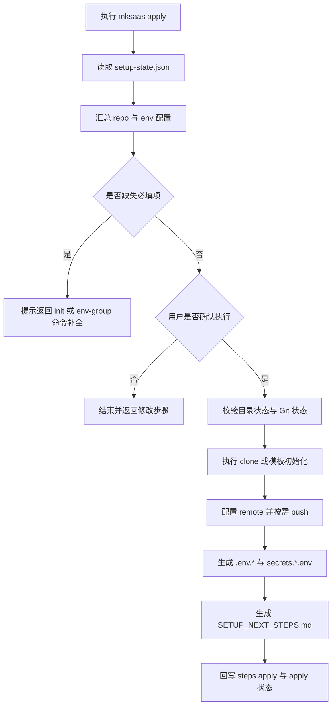
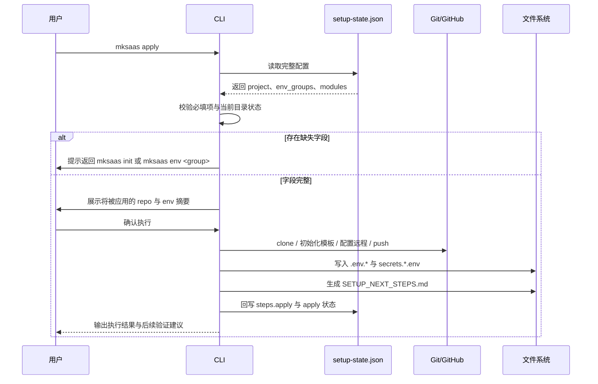

# 步骤 02：执行配置需求

## 1. 目标

本步骤是最后一步，负责把 `.mksaas/setup-state.json` 中已经确认好的配置真正应用到项目与仓库。

本步骤负责：

1. 根据仓库策略执行 clone 或模板初始化
2. 绑定远程并按需 push
3. 读取 JSON 中的环境信息并写入项目 `.env.*`
4. 生成 `secrets.*.env`
5. 生成 `SETUP_NEXT_STEPS.md`
6. 回写 `steps.apply` 和最终应用状态

## 2. 独立命令

```bash
mksaas apply
```

要求：

1. 该命令是最终统一执行命令
2. 启动时先读取完整 `.mksaas/setup-state.json`
3. 执行前先汇总展示将被应用的仓库与环境配置
4. 用户确认后才执行真实写入和 Git 操作

## 3. 前置依赖

`apply` 依赖以下信息已经在 JSON 中存在：

1. `project` 中的仓库信息
2. `profiles.<profile>.env_groups` 中的环境分组信息
3. `modules` 中的 provider 和启用状态

说明：

1. `apply` 不再向用户重复询问已经存在于 JSON 的信息
2. 若发现字段缺失，应提示用户返回 `mksaas init` 或 `mksaas env <group>` 补全

## 4. 流程图



## 5. 时序图



## 6. 输入

输入来源：

1. `.mksaas/setup-state.json`
2. 当前本地目录状态
3. 项目模板文件

## 7. 执行前交互

要求：

1. 启动时先读取完整 JSON
2. 汇总展示将要应用的仓库配置和环境配置
3. 询问用户是否立即执行
4. 如果用户选择返回修改，应允许退出并回到对应命令

## 8. 执行顺序

建议执行顺序：

1. 校验 JSON 必填项
2. 准备本地项目目录
3. 执行 clone 或模板初始化
4. 配置 Git remote
5. 按需 push 到远程
6. 生成 `.env.test`、`.env.prod`、`.env`
7. 生成 `.mksaas/secrets.test.env`、`.mksaas/secrets.prod.env`
8. 生成 `SETUP_NEXT_STEPS.md`
9. 回写 `setup-state.json` 的 `steps.apply` 和 `apply` 状态

## 9. 仓库执行规则

### 9.1 已有关联好项目仓库

要求：

1. 直接 clone
2. 不覆盖已有本地目录
3. clone 成功后回写本地路径

### 9.2 已有空仓库

要求：

1. 从模板初始化本地目录
2. 保留模板远程为 `template`
3. 将用户仓库设置为 `origin`
4. 根据配置执行首次 push

### 9.3 还没有仓库

要求：

1. 若 `repo_url` 仍为空，则阻止执行
2. 提示用户先回到 `mksaas init` 补全仓库信息

## 10. 环境落地规则

要求：

1. 从 JSON 的 `profiles.<profile>.env_groups` 读取环境变量
2. 非敏感值写入 `.env.test`、`.env.prod`、`.env`
3. 敏感值写入 `.mksaas/secrets.test.env`、`.mksaas/secrets.prod.env`
4. `.env` 默认同步为 `.env.test`
5. 若字段支持自动生成且为空，应在此步骤生成后再落盘
6. 具体字段清单与采集规则以 `docs/env-groups/*.md` 为准

## 11. 回写规则

本步骤执行完成后必须回写：

1. `steps.apply.status`
2. `steps.apply.updated_at`
3. `steps.apply.applied`
4. `steps.apply.applied_at`
5. `apply.last_run_at`
6. `apply.last_result`
7. `apply.last_applied_project_dir`

## 12. 异常处理

需要处理以下情况：

1. JSON 文件不存在
2. JSON 字段缺失
3. 本地目录冲突
4. Git clone 失败
5. Git push 失败
6. `.env` 输出目录不可写
7. 必填敏感字段缺失

## 13. 安全要求

1. 执行前摘要中不得展示完整敏感值
2. 终端日志不得输出 token、secret、password 全量内容
3. 生成的 secrets 文件权限尽量限制为当前用户
4. 不将 secrets 文件自动加入 Git
