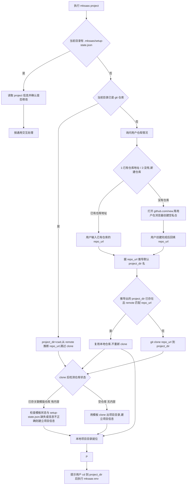

# 步骤 03：项目信息采集与本地就位

## 1. 目标

本步骤负责建立 `.mksaas/setup-state.json`，采集仓库与项目级基础信息，并让本地项目目录就绪（项目创建发生在此步骤）。它是单步命令，可单独运行、可重复运行，也可以被 `mksaas init` 编排调用。

说明：

1. `project` 负责初始化状态文件、采集仓库信息，并让本地项目目录就位
2. 本地项目就位（已 clone / 从模板初始化）在本步骤完成，apply 阶段不再 clone，只在该目录内改写配置并尝试 push
3. `.mksaas/` 状态目录位于本地项目目录内（即 git 仓库根目录内），由本步骤创建
4. 本步骤不执行 push（push 在 apply 阶段，且 apply 完一律尝试 push，不依赖任何策略标记）
5. 具体环境变量采集通过 `mksaas env <group> [--profile test|prod]` 完成

## 2. 独立命令

```bash
mksaas project
```

要求：

1. 该命令可单独执行、可重复执行
2. 启动时先读取 `.mksaas/setup-state.json`（若当前目录已是项目目录）
3. 若已有仓库与项目信息，先展示并让用户确认是否修改
4. 若状态文件不存在，则初始化默认结构
5. 修改完成后立即回写 JSON

## 3. 负责范围

`project` 负责以下内容：

1. 初始化 `.mksaas/setup-state.json`
2. 采集仓库来源与 `repo_url`
3. 采集 `project_dir`；仅空仓库初始化路径采集 `template_repo`、`template_branch`
4. 让本地项目目录就位（见第 7、8 节）
5. 在项目目录内创建 `.mksaas/` 状态目录
6. 初始化 `steps.project` 与 `steps.apply` 状态
7. 初始化 `profiles`、`modules`、`artifacts` 顶层结构

## 4. 目录关系与定位规则

`.mksaas/` 状态目录位于本地项目目录内，项目目录即为 git 仓库根目录：

```text
tourismchina/              ← 本地项目目录 = git 仓库根目录（project 就位的）
├── .mksaas/               ← 状态目录，gitignore
│   └── setup-state.json
├── (项目代码)
```

### 4.1 状态文件定位

CLI 启动时按以下顺序定位状态文件，状态文件所在决定项目根：

1. 当前工作目录是否存在 `.mksaas/setup-state.json`
2. 若存在：`.mksaas/` 的父目录即项目根目录，读取 JSON 中的 `project` 信息进入项目态
3. 若不存在：进入引导态，按 4.2 的判定流采集并就位

### 4.2 项目就位判定流

按固定顺序判定，避免场景冲突：

1. 当前工作目录存在 `.mksaas/setup-state.json`？是 → 项目态，读取已有 `project` 信息并按通用交互确认是否修改
2. 当前工作目录已是 git 仓库？是 → `project_dir = 当前目录`，从 `git remote -v` 推断 `repo_url`，跳过 clone，直接按第 5 步检测仓库状态分流（已存关联模版仓库 / 空仓库）
3. 否 → 询问用户仓库情况（见 7.1）：
   - `已有仓库地址` → 用户输入已有仓库的 `repo_url`
   - `没有仓库` → 打开 `https://github.com/new`，等用户在浏览器创建空私仓，创建完成后回填 `repo_url`
4. 拿到 `repo_url` 后据其推导默认 `project_dir` 名，执行 `git clone <repo_url> <project_dir>`（若推导出的 `project_dir` 已存在且 remote 匹配则复用，不重新 clone）
5. clone 完成后（或第 2 步已就位无需 clone 时）检测仓库状态分流，结果只可能是以下两种之一：
   - **已存关联模版仓库（有内容）** → 按 7.3：检查模板状态与是否已有 `.mksaas/setup-state.json` 及其信息是否正确，缺失或信息不正确则建立 `.mksaas/setup-state.json` 项目信息
   - **空仓库（无内容）** → 按 7.4：用模板 clone 出项目目录并建立 `.mksaas/setup-state.json` 项目信息

说明：

1. 全新项目无需用户手动建目录，由 `project` 负责创建项目目录与 `.mksaas/`
2. 从远程 clone 下来的仓库，clone 结果就是项目根目录本身，不是其子目录
3. 判定本地是否已 clone 不能只看目录是否存在，必须确认该目录是 git 仓库且其 remote 含 `repo_url`，避免同名空目录误判
4. 「已有仓库地址」与「没有仓库」是用户对仓库情况的二选一；仓库是空还是有内容由 clone 后自动检测，不再让用户手动指定 `direct_clone` / `template_init`
5. `project` 在内部用绝对路径操作项目目录；命令结束后用户 shell 仍在原目录，CLI 必须在结尾提示用户 `cd` 到项目目录后再执行 `mksaas env <group>`（后续命令需在项目目录内读取 `.mksaas/setup-state.json`）

## 5. 输入

用户输入信息：

1. 仓库来源
2. `repo_url`
3. 可选的本地目录
4. 可选的模板仓库地址
5. 可选的模板分支

执行前输入来源：

1. `.mksaas/setup-state.json`
2. 当前本地目录状态

## 6. 流程图



## 7. 本地项目就位规则

### 7.1 询问用户仓库情况

当当前目录既无 `.mksaas/setup-state.json`、也非 git 仓库时，询问用户仓库情况（二选一）：

1. `已有仓库地址`：用户输入已有仓库的 `repo_url`，进入 7.2 流程
2. `没有仓库`：打开 `https://github.com/new`，等待用户在浏览器创建空私仓，创建完成后回填 `repo_url`，进入 7.2 流程

无论哪种方式，拿到 `repo_url` 后都据其推导默认 `project_dir` 名，统一执行 clone + 状态检测分流，不再让用户手动指定 `direct_clone` / `template_init`。

### 7.2 clone 与仓库状态分流

拿到 `repo_url` 后：

1. 据其推导默认 `project_dir` 名
2. 若推导出的 `project_dir` 已存在，按其是否为同一仓库分流：
   - 是 git 仓库且 remote 含 `repo_url`（同一仓库）→ 复用，不重新 clone
   - 是 git 仓库但 remote 不含 `repo_url`（另一个仓库）→ 不覆盖，按 §10 异常处理（提示目录名冲突，询问改名或换目录）
   - 非 git 仓库（空目录或普通目录）→ 不直接 clone 进非空目录，按 §10 异常处理（提示清理后重试或换目录）
3. 仅当 `project_dir` 不存在时，执行 `git clone <repo_url> <project_dir>`
4. clone 完成后（或第 2 步已复用无需 clone 时）检测仓库状态分流，结果只可能是以下两种之一：
   - **已存关联模版仓库（有内容）** → 按 7.3 处理：检查模板状态与是否已有 `.mksaas/setup-state.json` 及其信息是否正确，缺失或信息不正确则建立项目信息
   - **空仓库（无内容）** → 按 7.4 处理：用模板 clone 出项目目录并建立项目信息

说明：本步骤不记录任何 apply 策略标记（如 `apply_strategy` / `should_push`）。apply 阶段行为统一——在已就位项目目录内改写配置后一律尝试 push，是否首次 push、远程是否已有内容等由 push 本身的结果决定，不预先标记。remote 是否含 `repo_url` 是判断「是否同一仓库」的硬判据，不匹配即视为不同仓库，绝不覆盖。

### 7.3 已存关联模版仓库

clone 下来的仓库已含项目内容（非空仓库），可能是用户已关联好模板的项目仓库：

1. 检查模板状态：若存在 `upstream` 远程，校验其指向合理模板地址；若仅有 `origin`，视为直接关联的项目仓库
2. 检查项目目录内是否已存在 `.mksaas/setup-state.json`：
   - 存在且 `project` 信息（`repo_url`、`project_dir` 等）正确 → 复用，仅按 7.6 确保 `.mksaas/` 完整
   - 缺失或信息不正确 → 建立 `.mksaas/setup-state.json`，写入 `repo_url`、`project_dir` 等
3. 不覆盖已有本地目录；若目录存在但非目标仓库，按 §10 异常处理
4. 就位后回写 `project_dir`

### 7.4 空仓库

clone 下来的是空仓库（无内容），需用模板初始化项目目录。直接用模板仓库 clone 出项目目录（注意此处 `<project_dir>` 即用户仓库的目标目录名）：

```bash
git clone https://github.com/your-username/mksaas-template.git <project_dir> --origin upstream
```

随后：

1. 校验模板默认分支并建立跟踪：`git checkout <template_branch>`，`git branch --set-upstream-to=upstream/<template_branch>`（默认 `main`）
2. `git remote add origin <repo_url>`（用户仓库远程为 `origin`）
3. 本步骤不执行 push（push 在 apply 阶段）
4. 建立 `.mksaas/setup-state.json`，写入 `repo_url`、`project_dir`、`template_repo`、`template_branch` 等
5. 就位后回写 `project_dir`

### 7.5 已在本地就位（当前目录即 git 仓库）

当 §4.2 第 2 步判定当前目录已是 git 仓库时适用：`project_dir = 当前目录`，从 `git remote -v` 推断 `repo_url`，不重新 clone，直接进入仓库状态分流（已存关联模版仓库 / 空仓库），分别按 7.3 / 7.4 处理。

1. 校验 `git remote -v`：当前目录的 `origin`（或任一 remote）必须与 `repo_url` 一致，方视为同一仓库。若当前目录是 git 仓库但 remote 指向别的地址，说明不是同一仓库，提示用户换到正确目录或重新指定，不强行覆盖
2. 若存在模板远程（`upstream`），校验其指向合理模板地址
3. 就位后回写 `project_dir`

### 7.6 状态目录创建

要求：

1. 本地项目目录就位后，在其内创建 `.mksaas/` 状态目录
2. 状态目录内写入 `setup-state.json`
3. `.mksaas/` 纳入 `.gitignore`

## 8. 行为要求

### 8.1 通用交互

要求：

1. 启动时按 §4.2 判定流定位状态文件与项目根
2. 若当前步骤已有配置，先列出已有值
3. 询问用户是否沿用已有配置
4. 如果用户选择修改，再进入输入流程
5. 修改或就位后立即回写 JSON
6. 结束时提示用户 `cd` 到 `project_dir` 后，再通过 `mksaas env <group> [--profile test|prod]` 补全环境配置

### 8.2 已经关联好 MkSaaS 项目仓库

要求：

1. 询问 `repo_url`
2. 根据 `repo_url` 推导默认本地目录名
3. 按 7.2 clone 并进入已存关联模版仓库分流（7.3）
4. 不重新初始化模板

### 8.3 已有空仓库

要求：

1. 询问 `repo_url`
2. 记录模板远程名称为 `upstream`、目标远程名称为 `origin`
3. 按 7.2 clone 并进入空仓库分流（7.4），用模板初始化项目目录
4. 本步骤不执行 push（push 在 apply 阶段，apply 完一律尝试 push）

### 8.4 还没有仓库

要求：

1. 打开 `https://github.com/new`
2. 提示用户创建空私仓
3. 用户创建完成后输入 `repo_url`
4. 然后按 8.3 空仓库初始化策略就位

## 9. 输出

本步骤结束后，必须在 JSON 状态文件中写入以下信息：

1. `repo_url`
2. `repo_name`
3. `project_dir`
4. `template_repo`（仅空仓库初始化路径有值）
5. `template_branch`（仅空仓库初始化路径有值）
6. `steps.project`
7. `steps.apply`

说明：不写入 `apply_strategy` / `should_push` 等 apply 策略标记。apply 阶段行为统一——在已就位项目目录内改写配置后一律尝试 push，不依赖预标记。

## 10. 异常处理

需要处理以下异常：

1. 本地目录已存在且非空、非目标仓库——分两种：是 git 仓库但 remote 不含 `repo_url`（另一个仓库）/ 非 git 仓库（普通或空目录）。均不覆盖，提示目录名冲突，询问改名或换目录
2. `repo_url` 为空
3. `repo_url` 含鉴权段（`user:token@`）——自动剥离后落盘，并提示用户改用 SSH key 或 HTTPS 凭据转发
4. clone 失败（含鉴权未配置导致的无权限失败）——提示用户检查 SSH key / `gh auth login` / credential helper，不自动注入凭据
5. 模板初始化失败
6. JSON 文件损坏或字段不合法
7. 用户拒绝确认已有配置
8. 仓库地址格式错误

## 11. 安全要求

1. `project.repo_url` 只存干净 URL，不含任何鉴权段
2. clone/push 鉴权由用户本地环境提供（SSH key / `gh auth login` / git credential helper / SSH agent forwarding），CLI 不内置凭据获取、存储或注入
3. 不在日志中泄露带鉴权信息的仓库地址；输出一律按干净 URL
4. 不自动创建 GitHub 仓库
5. 出错时给出明确中文提示
