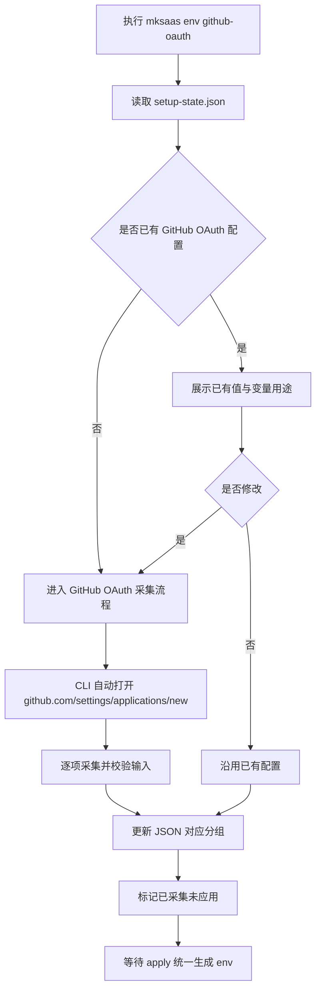
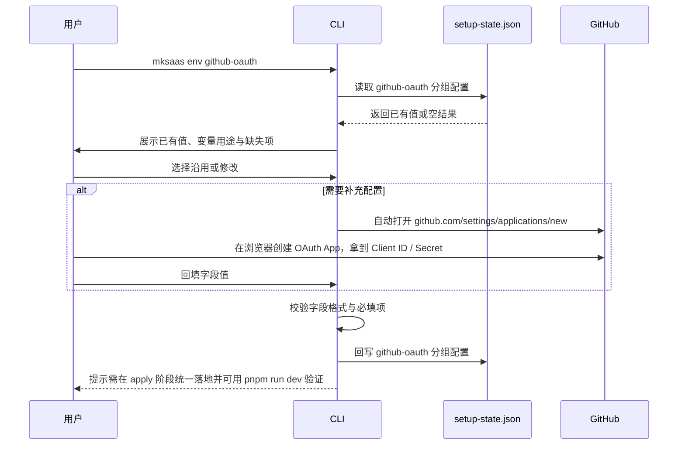

# GitHub OAuth 环境分组需求

## 1. 目标

本分组定义 `GitHub OAuth` 相关环境变量的采集、确认、回写与最终落地规则。

## 2. 参考说明

参考官方文档：

1. [MkSaaS 环境配置](https://mksaas.com/zh/docs/env)

需要遵循的基础原则：

1. 环境变量以项目根目录的 `.env` 体系为最终落点
2. 采集时应参考 `env.example` 或 `.env.example`
3. `.env`、`.env.test`、`.env.prod` 与整个 `.mksaas/` 目录都不能提交到版本控制
4. 最终完成配置后，应支持通过 `pnpm run dev` 验证环境是否正确

## 3. 独立命令

```bash
mksaas env github-oauth [--profile test|prod]
```

要求：

1. 该命令可单独执行
2. 启动时先读取 `.mksaas/setup-state.json`
3. 若 JSON 中已有值，必须先展示并让用户确认是否修改
4. 修改完成后立即回写 JSON

## 4. 变量范围

1. `GITHUB_CLIENT_ID`
2. `GITHUB_CLIENT_SECRET`

## 5. 采集流程说明

建议按以下顺序执行：

1. 读取 `.mksaas/setup-state.json` 中当前分组和当前 profile 的已有配置
2. 按“已存在值 / 未配置值 / 自动生成值”三类展示当前状态
3. 告知用户本分组对应的变量用途，并提示是否需要先去官方文档或第三方平台创建配置
4. 用户选择沿用已有值，或进入修改流程逐项填写
5. 进入采集流程时，由 CLI 自动打开 GitHub OAuth App 申请地址 `https://github.com/settings/applications/new`，等用户在浏览器创建应用并拿到 Client ID / Client Secret 后回填
6. 对输入值做基础校验，例如 URL、布尔值、价格 ID、站点 ID、密钥是否为空
7. 将结果回写到 `.mksaas/setup-state.json`，并标记当前分组已采集但尚未 apply
8. 在最后一步 `mksaas apply` 中，将本分组内容合并进 `.env.*`
9. apply 完成后，支持通过 `pnpm run dev` 做环境验证

## 6. 流程图



## 7. 时序图



## 8. 采集要求

1. 若已有配置，先展示 `CLIENT_ID` 摘要与 `CLIENT_SECRET` 已配置状态
2. 支持启用或禁用 GitHub OAuth
3. 进入采集流程时由 CLI 自动打开 `https://github.com/settings/applications/new`，等用户创建应用后回填 Client ID / Client Secret
4. 创建应用时所需的 Authorization callback URL 取自当前 profile 的 `NEXT_PUBLIC_BASE_URL` + `/api/auth/callback/github`，由 CLI 在打开前提示用户填入

## 9. 生成要求

1. `GITHUB_CLIENT_ID` 与 `GITHUB_CLIENT_SECRET` 统一写入 `.env.*`
2. 未启用时可跳过输出

## 10. 安全要求

1. 不得在终端打印完整 secret
2. 终端输出以已配置状态展示

