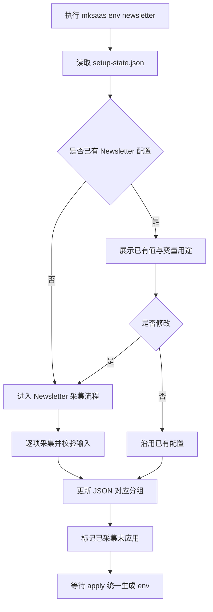
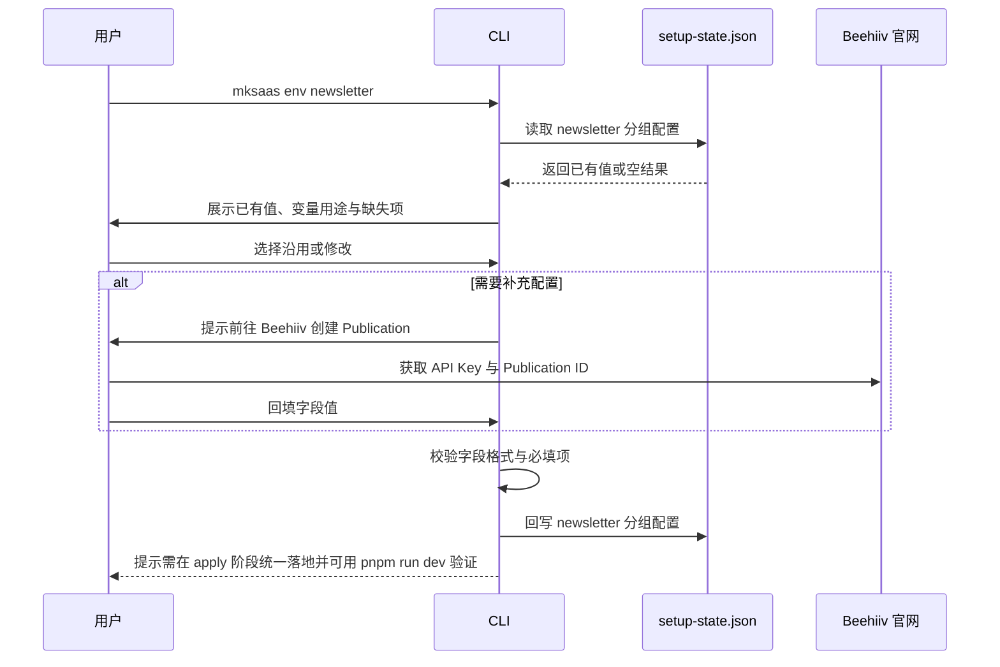

# Newsletter 环境分组需求

## 1. 目标

本分组定义订阅与 Newsletter（邮件订阅列表）相关环境变量的采集、确认、回写与最终落地规则。基于 Beehiiv 提供订阅表单、订阅者管理与批量发送；事务发信见 [06-email.md](06-email.md)。

## 2. 参考说明

参考官方文档：

1. [MkSaaS 环境配置](https://mksaas.com/zh/docs/env)

需要遵循的基础原则：

1. 环境变量以项目根目录的 `.env` 体系为最终落点
2. 采集时应参考 `env.example` 或 `.env.example`
3. `.env`、`.env.test`、`.env.prod` 与整个 `.mksaas/` 目录都不能提交到版本控制
4. 最终完成配置后，应支持通过 `pnpm run dev` 验证环境是否正确

## 3. 独立命令

```bash
mksaas env newsletter [--profile test|prod]
```

要求：

1. 该命令可单独执行
2. 启动时先读取 `.mksaas/setup-state.json`
3. 若 JSON 中已有值，必须先展示并让用户确认是否修改
4. 修改完成后立即回写 JSON

## 4. 变量范围

1. `BEEHIIV_API_KEY`
2. `BEEHIIV_PUBLICATION_ID`

## 5. 采集流程说明

建议按以下顺序执行：

1. 读取 `.mksaas/setup-state.json` 中当前分组和当前 profile 的已有配置
2. 按“已存在值 / 未配置值 / 自动生成值”三类展示当前状态
3. 告知用户本分组对应的变量用途，并提示是否需要先去官方文档或第三方平台创建配置
4. 用户选择沿用已有值，或进入修改流程逐项填写
5. 对输入值做基础校验，例如站点 ID、密钥是否为空
6. 将结果回写到 `.mksaas/setup-state.json`，并标记当前分组已采集但尚未 apply
7. 在最后一步 `mksaas apply` 中，将本分组内容合并进 `.env.*`
8. apply 完成后，支持通过 `pnpm run dev` 做环境验证

## 6. 流程图



## 7. 时序图



## 8. 采集要求

1. 若已有配置，先展示 `BEEHIIV_API_KEY` 已配置状态与 `BEEHIIV_PUBLICATION_ID` 值，并询问是否修改
2. 提示用户先到 Beehiiv 官网创建 Publication 并生成 API Key
3. `BEEHIIV_API_KEY` 与 `BEEHIIV_PUBLICATION_ID` 通常成对出现，建议在同一会话内填写
4. 可单独跳过本分组（仅影响订阅能力，不影响事务发信）

## 9. 生成要求

1. `BEEHIIV_API_KEY` 与 `BEEHIIV_PUBLICATION_ID` 统一写入 `.env.*`
2. 未配置时可跳过输出（写空串）

## 10. 安全要求

1. 不得在终端明文展示 API Key
2. 终端输出以已配置状态展示
