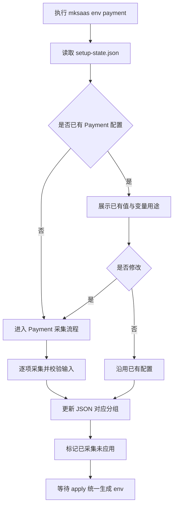
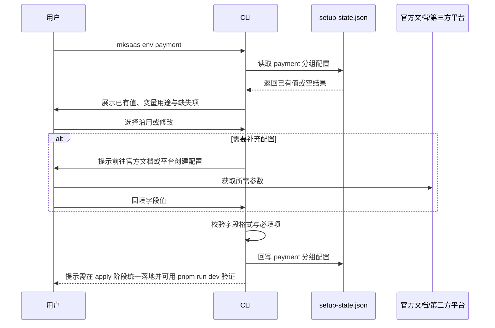

# Payment 环境分组需求

## 1. 目标

本分组定义 `Payment` 相关环境变量的采集、确认、回写与最终落地规则。

## 2. 参考说明

参考官方文档：

1. [MkSaaS 环境配置](https://mksaas.com/zh/docs/env)

需要遵循的基础原则：

1. 环境变量以项目根目录的 `.env` 体系为最终落点
2. 采集时应参考 `env.example` 或 `.env.example`
3. `.env`、`.env.test`、`.env.prod` 与整个 `.mksaas/` 目录都不能提交到版本控制
4. 最终完成配置后，应支持通过 `pnpm run dev` 验证环境是否正确

## 3. 独立命令

```bash
mksaas env payment [--profile test|prod]
```

要求：

1. 该命令可单独执行
2. 启动时先读取 `.mksaas/setup-state.json`
3. 若 JSON 中已有值，必须先展示并让用户确认是否修改
4. 修改完成后立即回写 JSON

## 4. 变量范围

1. `STRIPE_SECRET_KEY`
2. `STRIPE_WEBHOOK_SECRET`
3. `NEXT_PUBLIC_STRIPE_PRICE_PRO_MONTHLY`
4. `NEXT_PUBLIC_STRIPE_PRICE_PRO_YEARLY`
5. `NEXT_PUBLIC_STRIPE_PRICE_LIFETIME`
6. `NEXT_PUBLIC_STRIPE_PRICE_CREDITS_BASIC`
7. `NEXT_PUBLIC_STRIPE_PRICE_CREDITS_STANDARD`
8. `NEXT_PUBLIC_STRIPE_PRICE_CREDITS_PREMIUM`
9. `NEXT_PUBLIC_STRIPE_PRICE_CREDITS_ENTERPRISE`
10. `VITE_PAYMENT_PROVIDER`（支付提供商开关：`stripe` / `creem`，按所选提供商自动写入）
11. `CREEM_API_KEY`
12. `CREEM_WEBHOOK_SECRET`
13. `VITE_CREEM_PRODUCT_PRO_MONTHLY`
14. `VITE_CREEM_PRODUCT_PRO_YEARLY`
15. `VITE_CREEM_PRODUCT_LIFETIME`

## 5. 采集流程说明

建议按以下顺序执行：

1. 读取 `.mksaas/setup-state.json` 中当前分组和当前 profile 的已有配置
2. 按“已存在值 / 未配置值 / 自动生成值”三类展示当前状态
3. 选择支付提供商：Stripe 或 Creem（或「跳过/手动输入」采集全部变量）
4. 选定后自动打开对应控制台（Stripe → `https://dashboard.stripe.com/`，Creem → `https://creem.io/`），并按顺序打印创建步骤：创建账户 → 获取 API 密钥 → 设置 Webhook（URL 形如 `<base_url>/api/webhooks/{stripe|creem}`，需先采集 core 的 NEXT_PUBLIC_BASE_URL）→ 创建产品与价格计划
5. 仅采集所选提供商相关变量（Stripe 9 个 / Creem 5 个）；`VITE_PAYMENT_PROVIDER` 按选择自动写入（`stripe` / `creem`），无需手动填写
6. 用户选择沿用已有值，或进入修改流程逐项填写（每行留空=保留）
7. 对输入值做基础校验，例如密钥是否为空
8. 将结果回写到 `.mksaas/setup-state.json`，并标记当前分组已采集但尚未 apply
9. 在最后一步 `mksaas apply` 中，将本分组内容合并进 `.env.*`
10. apply 完成后，支持通过 `pnpm run dev` 做环境验证

## 6. 流程图



## 7. 时序图



## 8. 采集要求

1. 支持 Stripe 与 Creem 两种支付提供商，二者互斥，由 `VITE_PAYMENT_PROVIDER` 开关切换
2. 若已有值，先展示价格 ID 摘要和 secret 已配置状态
3. 采集时先选择提供商，按选择自动打开对应控制台并引导创建账户、API 密钥、Webhook、产品与价格计划；`VITE_PAYMENT_PROVIDER` 随选择自动写入，无需手动填

## 9. 生成要求

1. secret 字段与价格 ID 统一写入 `.env.*`
2. 未启用支付时可跳过输出

## 10. 安全要求

1. 不得打印 secret 全量内容
2. 终端输出以已配置状态展示

