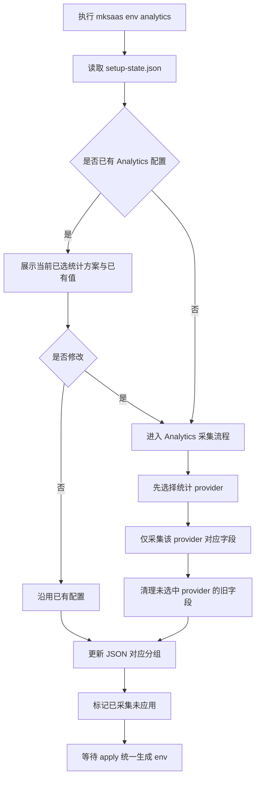
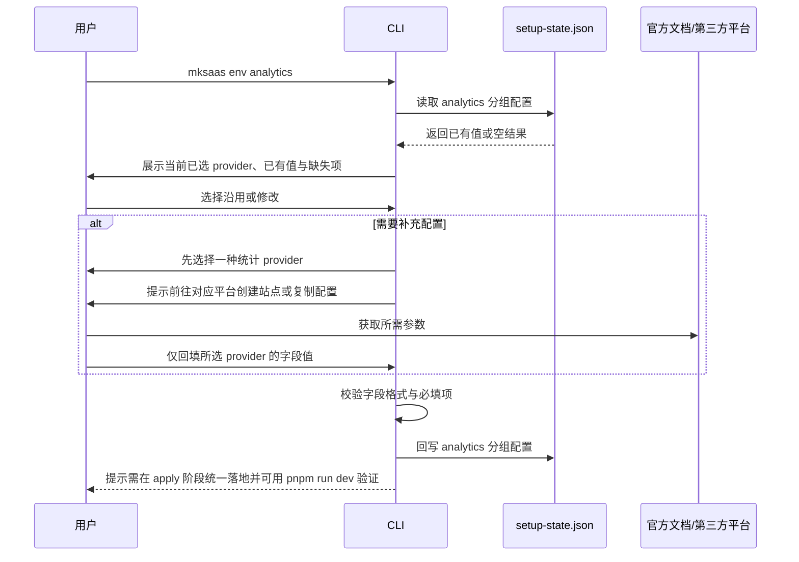

# Analytics 环境分组需求

## 1. 目标

本分组定义 `Analytics` 相关环境变量的采集、确认、回写与最终落地规则。

## 2. 参考说明

参考官方文档：

1. [MkSaaS 环境配置](https://mksaas.com/zh/docs/env)

需要遵循的基础原则：

1. 环境变量以项目根目录的 `.env` 体系为最终落点
2. 采集时应参考 `env.example` 或 `.env.example`
3. `.env`、`.env.test`、`.env.prod` 与整个 `.mksaas/` 目录都不能提交到版本控制
4. 最终完成配置后，应支持通过 `pnpm run dev` 验证环境是否正确

## 3. 独立命令

```bash
mksaas env analytics [--profile test|prod]
```

要求：

1. 该命令可单独执行
2. 启动时先读取 `.mksaas/setup-state.json`
3. 若 JSON 中已有值，必须先展示并让用户确认是否修改
4. 修改完成后立即回写 JSON

## 4. 变量范围

1. `NEXT_PUBLIC_GOOGLE_ANALYTICS_ID`
2. `NEXT_PUBLIC_UMAMI_WEBSITE_ID`
3. `NEXT_PUBLIC_UMAMI_SCRIPT`
4. `NEXT_PUBLIC_OPENPANEL_CLIENT_ID`
5. `NEXT_PUBLIC_PLAUSIBLE_DOMAIN`
6. `NEXT_PUBLIC_PLAUSIBLE_SCRIPT`
7. `NEXT_PUBLIC_AHREFS_WEBSITE_ID`
8. `NEXT_PUBLIC_SELINE_TOKEN`
9. `NEXT_PUBLIC_DATAFAST_WEBSITE_ID`
10. `NEXT_PUBLIC_DATAFAST_DOMAIN`
11. `NEXT_PUBLIC_POSTHOG_KEY`
12. `NEXT_PUBLIC_POSTHOG_HOST`
13. `NEXT_PUBLIC_CLARITY_PROJECT_ID`

## 5. 采集流程说明

建议按以下顺序执行：

1. 读取 `.mksaas/setup-state.json` 中当前分组和当前 profile 的已有配置
2. 按“已存在值 / 未配置值 / 自动生成值”三类展示当前状态
3. 先让用户选择一种统计方案，例如 Google Analytics、Umami、Plausible、PostHog、Clarity 等
4. 根据所选方案，只展示并采集该 provider 对应字段，而不是把所有统计平台字段一起逐项询问
5. 告知用户该方案对应字段的用途，并提示是否需要先去官方文档或第三方平台创建站点或获取 ID / token
6. 对输入值做基础校验，例如 URL、站点 ID、脚本地址、token 是否为空
7. 将结果回写到 `.mksaas/setup-state.json`，并清理未选中 provider 的旧字段，标记当前分组已采集但尚未 apply
8. 在最后一步 `mksaas apply` 中，将本分组内容合并进 `.env.*`
9. apply 完成后，支持通过 `pnpm run dev` 做环境验证

## 6. 流程图



## 7. 时序图



## 8. 采集要求

1. 进入本分组后必须先选择一种统计 provider
2. 仅采集当前所选 provider 对应字段，不应把所有 provider 的字段一起展示
3. 若已有值，先展示当前已选择的 provider 和已配置字段列表
4. 提示用户先到对应统计平台创建站点并复制站点 ID、脚本地址、域名或 token

## 9. 生成要求

1. 默认写入 `.env.*`
2. 未选中的 provider 字段应按 schema 默认值或空值输出，不保留旧 provider 残留值
3. 当前仅应保留所选 provider 的有效配置

## 10. 安全要求

1. 本分组默认视为非敏感
2. 如后续出现私有 token，采集时使用隐藏输入，终端不打印完整值
