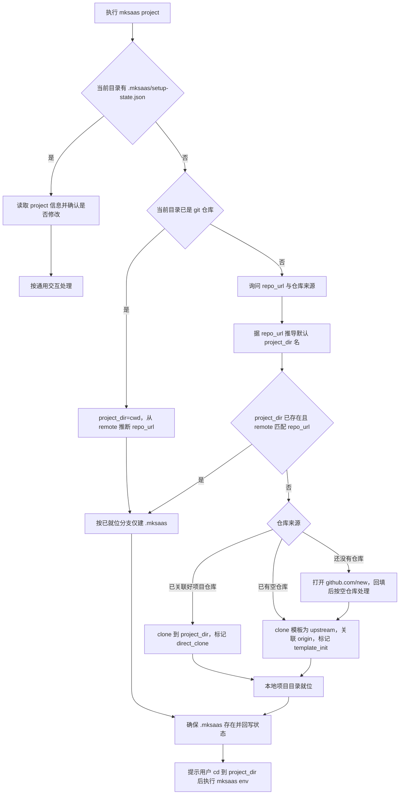

# 步骤 03：项目信息采集与本地就位

## 1. 目标

本步骤负责建立 `.mksaas/setup-state.json`，采集仓库与项目级基础信息，并让本地项目目录就绪（项目创建发生在此步骤）。它是单步命令，可单独运行、可重复运行，也可以被 `mksaas init` 编排调用。

说明：

1. `project` 负责初始化状态文件、采集仓库信息，并让本地项目目录就位
2. 本地项目就位（已 clone / 从模板初始化 / 建空目录）在本步骤完成，不在 apply 阶段
3. `.mksaas/` 状态目录位于本地项目目录内（即 git 仓库根目录内），由本步骤创建
4. 本步骤不执行 push（push 在 apply 阶段）
5. 具体环境变量采集通过 `mksaas env <group> [--profile test|prod]` 完成

## 2. 独立命令

```bash
mksaas project
```

要求：

1. 该命令可单独执行、可重复执行
2. 启动时先读取 `.mksaas/setup-state.json`（若当前目录已是项目目录）
3. 若已有仓库与项目信息，先展示并让用户确认是否修改
4. 若状态文件不存在，则初始化默认结构
5. 修改完成后立即回写 JSON

## 3. 负责范围

`project` 负责以下内容：

1. 初始化 `.mksaas/setup-state.json`
2. 采集仓库来源与 `repo_url`
3. 采集 `project_dir`、`template_repo`、`template_branch`
4. 让本地项目目录就位（见第 7、8 节）
5. 在项目目录内创建 `.mksaas/` 状态目录
6. 初始化 `steps.project` 与 `steps.apply` 状态
7. 初始化 `profiles`、`modules`、`artifacts` 顶层结构

## 4. 目录关系与定位规则

`.mksaas/` 状态目录位于本地项目目录内，项目目录即为 git 仓库根目录：

```text
tourismchina/              ← 本地项目目录 = git 仓库根目录（project 就位的）
├── .mksaas/               ← 状态目录，gitignore
│   └── setup-state.json
├── (项目代码)
```

### 4.1 状态文件定位

CLI 启动时按以下顺序定位状态文件，状态文件所在决定项目根：

1. 当前工作目录是否存在 `.mksaas/setup-state.json`
2. 若存在：`.mksaas/` 的父目录即项目根目录，读取 JSON 中的 `project` 信息进入项目态
3. 若不存在：进入引导态，按 4.2 的判定流采集并就位

### 4.2 项目就位判定流

按固定顺序判定，避免场景冲突：

1. 当前工作目录存在 `.mksaas/setup-state.json`？是 → 项目态，读取已有 `project` 信息并按通用交互确认是否修改
2. 当前工作目录已是 git 仓库？是 → `project_dir = 当前目录`，从 `git remote -v` 推断 `repo_url`，按 7.1（已就位分支）确保 `.mksaas/` 存在
3. 否 → 询问 `repo_url` 与仓库来源（已关联好项目仓库 / 已有空仓库 / 还没有仓库），据 `repo_url` 推导默认 `project_dir` 名
4. 判定推导出的 `project_dir` 是否已存在且为 git 仓库且其 remote 匹配 `repo_url`：
   - 匹配 → 已在本地 clone，按 7.1 已就位分支仅建 `.mksaas/`
   - 不存在 → 按仓库来源分流到 7.1（direct_clone）/ 7.2（template_init）

说明：

1. 全新项目无需用户手动建目录，由 `project` 负责创建项目目录与 `.mksaas/`
2. 从远程 clone 下来的仓库，clone 结果就是项目根目录本身，不是其子目录
3. 判定本地是否已 clone 不能只看目录是否存在，必须确认该目录是 git 仓库且其 remote 含 `repo_url`，避免同名空目录误判
4. `project` 在内部用绝对路径操作项目目录；命令结束后用户 shell 仍在原目录，CLI 必须在结尾提示用户 `cd` 到项目目录后再执行 `mksaas env <group>`（后续命令需在项目目录内读取 `.mksaas/setup-state.json`）

## 5. 输入

用户输入信息：

1. 仓库来源
2. `repo_url`
3. 可选的本地目录
4. 可选的模板仓库地址
5. 可选的模板分支

执行前输入来源：

1. `.mksaas/setup-state.json`
2. 当前本地目录状态

## 6. 流程图



## 7. 本地项目就位规则

### 7.1 已关联好 MkSaaS 项目仓库（direct_clone）

要求：

1. 若本地 `project_dir` 已是该仓库的有效 git 仓库（remote 匹配 `repo_url`），直接复用，不重新 clone
2. 若 `project_dir` 不存在，则 `git clone <repo_url> <project_dir>`，clone 结果即项目根目录
3. 不覆盖已有本地目录；若目录存在但非目标仓库，按 §10 异常处理
4. 就位后回写 `project_dir`

### 7.2 已有空仓库（template_init）

采用 `clone --origin upstream` 方式初始化，命令级顺序固定如下：

1. `git clone <template_repo> <project_dir> --origin upstream`（模板远程命名为 `upstream`，便于日后 `git fetch upstream` 拉取模板更新）
2. `cd <project_dir>`
3. 校验模板默认分支并建立跟踪：`git checkout <template_branch>`，`git branch --set-upstream-to=upstream/<template_branch>`
4. `git remote add origin <repo_url>`（用户仓库远程为 `origin`）
5. 标记 `apply_strategy` 为 `template_init`、`should_push` 为 true（首次 push 在 apply 阶段）
6. 本步骤不执行 push
7. 就位后回写 `project_dir`

### 7.3 还没有仓库

要求：

1. 打开 `https://github.com/new`
2. 提示用户创建空私仓
3. 用户创建完成后输入 `repo_url`
4. 然后按 7.2 空仓库初始化策略就位

### 7.4 已在本地就位（existing_local）

当当前目录已是 git 仓库，或推导出的 `project_dir` 已存在且 remote 匹配 `repo_url` 时适用：

1. 不重新 clone 或初始化
2. 校验 `git remote -v` 是否含 `origin` → `repo_url`；若缺，提示用户补全或询问是否由 CLI 自动 `git remote add`
3. 若存在模板远程（`upstream`），校验其指向合理模板地址
4. 仅在项目目录内创建 `.mksaas/` 状态目录（若不存在）
5. 就位后回写 `project_dir`

### 7.5 状态目录创建

要求：

1. 本地项目目录就位后，在其内创建 `.mksaas/` 状态目录
2. 状态目录内写入 `setup-state.json`
3. `.mksaas/` 纳入 `.gitignore`

## 8. 行为要求

### 8.1 通用交互

要求：

1. 启动时按 §4.2 判定流定位状态文件与项目根
2. 若当前步骤已有配置，先列出已有值
3. 询问用户是否沿用已有配置
4. 如果用户选择修改，再进入输入流程
5. 修改或就位后立即回写 JSON
6. 结束时提示用户 `cd` 到 `project_dir` 后，再通过 `mksaas env <group> [--profile test|prod]` 补全环境配置

### 8.2 已经关联好 MkSaaS 项目仓库

要求：

1. 询问 `repo_url`
2. 根据 `repo_url` 推导默认本地目录名
3. 标记 `apply_strategy` 为 `direct_clone`
4. 按 7.1 让本地目录就位
5. 不重新初始化模板

### 8.3 已有空仓库

要求：

1. 询问 `repo_url`
2. 标记 `apply_strategy` 为 `template_init`
3. 记录模板远程名称为 `upstream`、目标远程名称为 `origin`
4. 标记 `should_push` 为 true
5. 按 7.2 让本地目录就位

### 8.4 还没有仓库

要求：

1. 打开 `https://github.com/new`
2. 提示用户创建空私仓
3. 用户创建完成后输入 `repo_url`
4. 然后按 8.3 空仓库初始化策略就位

## 9. 输出

本步骤结束后，必须在 JSON 状态文件中写入以下信息：

1. 仓库类型
2. `repo_url`
3. `repo_name`
4. `project_dir`
5. `template_repo`
6. `template_branch`
7. `apply_strategy`
8. `should_push`
9. `steps.project`
10. `steps.apply`

## 10. 异常处理

需要处理以下异常：

1. 本地目录已存在且非空、非目标仓库
2. `repo_url` 为空
3. `repo_url` 含鉴权段（`user:token@`）——自动剥离后落盘，并提示用户改用 SSH key 或 HTTPS 凭据转发
4. clone 失败（含鉴权未配置导致的无权限失败）——提示用户检查 SSH key / `gh auth login` / credential helper，不自动注入凭据
5. 模板初始化失败
6. JSON 文件损坏或字段不合法
7. 用户拒绝确认已有配置
8. 仓库地址格式错误

## 11. 安全要求

1. `project.repo_url` 只存干净 URL，不含任何鉴权段
2. clone/push 鉴权由用户本地环境提供（SSH key / `gh auth login` / git credential helper / SSH agent forwarding），CLI 不内置凭据获取、存储或注入
3. 不在日志中泄露带鉴权信息的仓库地址；输出一律按干净 URL
4. 不自动创建 GitHub 仓库
5. 出错时给出明确中文提示
