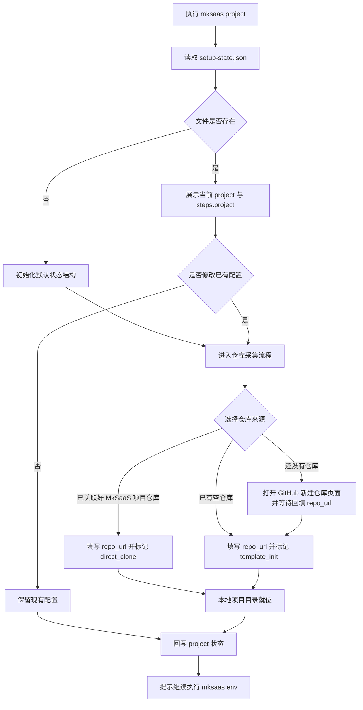

# 步骤 03：项目信息采集与本地就位

## 1. 目标

本步骤负责建立 `.mksaas/setup-state.json`，采集仓库与项目级基础信息，并让本地项目目录就绪（项目创建发生在此步骤）。它是单步命令，可单独运行、可重复运行，也可以被 `mksaas init` 编排调用。

说明：

1. `project` 负责初始化状态文件、采集仓库信息，并让本地项目目录就位
2. 本地项目就位（已 clone / 从模板初始化 / 建空目录）在本步骤完成，不在 apply 阶段
3. `.mksaas/` 状态目录位于本地项目目录内（即 git 仓库根目录内），由本步骤创建
4. 本步骤不执行 push（push 在 apply 阶段）
5. 具体环境变量采集通过 `mksaas env <group> [--profile test|prod]` 完成

## 2. 独立命令

```bash
mksaas project
```

要求：

1. 该命令可单独执行、可重复执行
2. 启动时先读取 `.mksaas/setup-state.json`（若当前目录已是项目目录）
3. 若已有仓库与项目信息，先展示并让用户确认是否修改
4. 若状态文件不存在，则初始化默认结构
5. 修改完成后立即回写 JSON

## 3. 负责范围

`project` 负责以下内容：

1. 初始化 `.mksaas/setup-state.json`
2. 采集仓库来源与 `repo_url`
3. 采集 `project_dir`、`template_repo`、`template_branch`
4. 让本地项目目录就位（见第 7、8 节）
5. 在项目目录内创建 `.mksaas/` 状态目录
6. 初始化 `steps.project` 与 `steps.apply` 状态
7. 初始化 `profiles`、`modules`、`artifacts` 顶层结构

## 4. 目录关系

`.mksaas/` 状态目录位于本地项目目录内，项目目录即为 git 仓库根目录：

```text
tourismchina/              ← 本地项目目录 = git 仓库根目录（project 就位的）
├── .mksaas/               ← 状态目录，gitignore
│   └── setup-state.json
├── (项目代码)
```

说明：

1. 全新项目无需用户手动建目录，由 `project` 负责创建项目目录与 `.mksaas/`
2. 从远程 clone 下来的仓库，clone 结果就是项目根目录本身，不是其子目录
3. 已有仓库场景下，用户 `cd` 进入项目目录执行 `project`，检测到已是 git 仓库则不重新拉取，仅确保 `.mksaas/` 存在

## 5. 输入

用户输入信息：

1. 仓库来源
2. `repo_url`
3. 可选的本地目录
4. 可选的模板仓库地址
5. 可选的模板分支

执行前输入来源：

1. `.mksaas/setup-state.json`
2. 当前本地目录状态

## 6. 流程图



## 7. 本地项目就位规则

### 7.1 已关联好 MkSaaS 项目仓库

要求：

1. 若本地目录已是该仓库的有效 git 仓库，直接复用，不重新 clone
2. 若本地目录不存在，则 clone 到本地，clone 结果即项目根目录
3. 不覆盖已有本地目录
4. 就位后回写 `project_dir`

### 7.2 已有空仓库

要求：

1. 从 MkSaaS 模板初始化本地目录
2. 保留模板远程为 `template`
3. 将用户仓库设置为 `origin`
4. 本步骤不执行 push（push 在 apply 阶段）
5. 就位后回写 `project_dir`

### 7.3 还没有仓库

要求：

1. 打开 `https://github.com/new`
2. 提示用户创建空私仓
3. 用户创建完成后输入 `repo_url`
4. 然后按 7.2 空仓库初始化策略就位

### 7.4 状态目录创建

要求：

1. 本地项目目录就位后，在其内创建 `.mksaas/` 状态目录
2. 状态目录内写入 `setup-state.json`
3. `.mksaas/` 纳入 `.gitignore`

## 8. 行为要求

### 8.1 通用交互

要求：

1. 启动时先读取 `.mksaas/setup-state.json`
2. 如果当前步骤已有配置，先列出已有值
3. 询问用户是否沿用已有配置
4. 如果用户选择修改，再进入输入流程
5. 修改后立即回写 JSON
6. 提示用户继续通过 `mksaas env <group> [--profile test|prod]` 补全环境配置

### 8.2 已经关联好 MkSaaS 项目仓库

要求：

1. 询问 `repo_url`
2. 根据 `repo_url` 推导默认本地目录名
3. 标记 `apply_strategy` 为 `direct_clone`
4. 按 7.1 让本地目录就位
5. 不重新初始化模板

### 8.3 已有空仓库

要求：

1. 询问 `repo_url`
2. 标记 `apply_strategy` 为 `template_init`
3. 记录模板远程名称为 `template`、目标远程名称为 `origin`
4. 标记 `should_push` 为 true
5. 按 7.2 让本地目录就位

### 8.4 还没有仓库

要求：

1. 打开 `https://github.com/new`
2. 提示用户创建空私仓
3. 用户创建完成后输入 `repo_url`
4. 然后按 8.3 空仓库初始化策略就位

## 9. 输出

本步骤结束后，必须在 JSON 状态文件中写入以下信息：

1. 仓库类型
2. `repo_url`
3. `repo_name`
4. `project_dir`
5. `template_repo`
6. `template_branch`
7. `apply_strategy`
8. `should_push`
9. `steps.project`
10. `steps.apply`

## 10. 异常处理

需要处理以下异常：

1. 本地目录已存在且非空、非目标仓库
2. `repo_url` 为空
3. clone 失败
4. 模板初始化失败
5. JSON 文件损坏或字段不合法
6. 用户拒绝确认已有配置
7. 仓库地址格式错误

## 11. 安全要求

1. 不在日志中泄露带鉴权信息的仓库地址
2. 不自动创建 GitHub 仓库
3. 出错时给出明确中文提示
