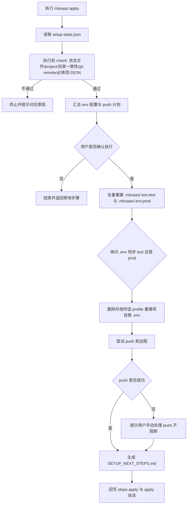
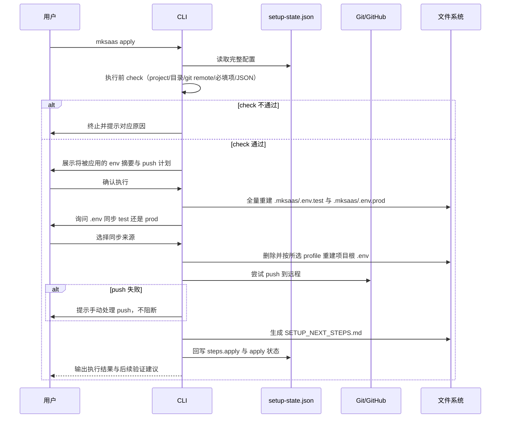

# 步骤 02：执行配置需求

## 1. 目标

本步骤是最后一步，负责把 `.mksaas/setup-state.json` 中已经确认好的配置真正应用到项目：生成环境文件、尝试 push 到远程。

本步骤负责：

1. 全量重建 `.env.test` 与 `.env.prod`（落点为 `.mksaas/`）
2. 询问用户 `.env` 同步来源，复制为项目代码根目录的 `.env`
3. 生成环境文件后一律尝试 push 到远程（push 失败不阻断，提示用户手动处理）
4. 生成 `SETUP_NEXT_STEPS.md`
5. 回写 `steps.apply` 和最终应用状态

说明：

1. 本地项目目录的就位（clone、模板初始化）已在 `mksaas project` 完成，apply 不再执行 clone 或模板初始化
2. apply 只在本地项目目录内生成环境文件并尝试 push

## 2. 独立命令

```bash
mksaas apply
```

要求：

1. 该命令是最终统一执行命令
2. 启动时先读取完整 `.mksaas/setup-state.json`
3. 执行前先做 check（见 §3），再汇总展示将被应用的环境配置与 push 计划
4. 用户确认后才执行真实写入和 Git 操作

## 3. 执行前 check

apply 启动后、汇总展示前，必须依次完成以下 check，任一项不通过即终止并给出明确中文提示，不进入写入与 Git 操作：

1. **状态文件存在**：当前目录存在 `.mksaas/setup-state.json`；不存在则提示先执行 `mksaas project`
2. **project 信息存在且有效**：JSON 含 `project`，且关键字段 `project_dir`、`repo_url` 齐全；缺失则终止并提示先执行 `mksaas project` 完成项目就位
3. **当前目录是目标项目**：当前工作目录与 `project.project_dir` 一致（即已在项目目录内运行）；不一致则提示用户 `cd` 到 `project_dir` 后重试
4. **项目目录是有效 git 仓库且 remote 含 `repo_url`**：校验当前目录是 git 仓库、其 remote 含 `repo_url`（同一仓库判据）；不匹配则提示项目就位异常，回到 `mksaas project` 处理
5. **环境必填项齐全**：按 `docs/env-schema.yaml` 校验必填变量已采集且非空；缺失则提示返回 `mksaas env <group>` 补全
6. **JSON 字段合法**：JSON 可解析且关键字段类型合法；损坏则提示修复或重建

说明：

1. check 不修改任何文件与 Git 状态，纯校验
2. check 全部通过后才进入 §4 执行前交互与后续写入
3. `project` 信息是 apply 的硬前置，不再有「无 project 则跳过 push」的分支

## 4. 前置依赖

`apply` 依赖以下信息已经在 JSON 中存在：

1. `profiles.<profile>.env_groups` 中的环境分组信息
2. `modules` 中的 provider 和启用状态
3. `project` 中的仓库信息（必需，含 `project_dir` 与 `repo_url`）

说明：

1. `apply` 不再向用户重复询问已经存在于 JSON 的信息
2. 若发现环境必填项缺失，应提示用户返回 `mksaas env <group>` 补全
3. 逐步模式下，用户可任意搭配：任意单个或多个 `mksaas env <group>` 即可直接 `mksaas apply`，`project` 必需，无需走完整 `init` 流程，也无需采集全部分组
4. apply 只校验环境必填项是否齐全，不强制要求所有 env 分组都已采集

## 5. 流程图



## 6. 时序图



## 7. 输入

输入来源：

1. `.mksaas/setup-state.json`
2. 当前本地项目目录状态

## 8. 执行前交互

要求：

1. 启动时先读取完整 JSON
2. 完成执行前 check（§3）
3. 汇总展示将要应用的环境配置与 push 计划
4. 询问用户是否立即执行
5. 如果用户选择返回修改，应允许退出并回到对应命令

## 9. 执行顺序

建议执行顺序：

1. 读取完整 JSON，执行 §3 check（project 信息、目录一致性、git remote、环境必填项、JSON 合法性）；任一不通过即终止
2. 汇总展示将被应用的 env 摘要与 push 计划，用户确认
3. 全量重建 `.mksaas/.env.test` 与 `.mksaas/.env.prod`
4. 询问用户 `.env` 同步 `test` 还是 `prod`，删除并按所选 profile 重建项目根 `.env`
5. 尝试 push 到远程；push 失败则提示用户手动处理，不阻断后续步骤
6. 生成 `SETUP_NEXT_STEPS.md`
7. 回写 `setup-state.json` 的 `steps.apply` 和 `apply` 状态

## 10. 远程发布规则

apply 生成环境文件后一律尝试 push 到远程（`origin`）。push 不预先依赖任何策略标记（不读 `should_push` / `apply_strategy`，二者已不在状态文件中）。

说明：

1. 项目目录已由 `project` 就位，apply 不再 clone、不再初始化模板
2. 若存在模板远程 `upstream`，apply 不动它，仅向 `origin` push
3. push 一律尝试，不因「远程已有内容」而跳过

### 10.1 push 执行

要求：

1. push 使用的 `repo_url` 为干净 URL，不含鉴权段
2. 将本地变更 push 到 `origin`
3. 不覆盖、不强制覆盖远程已有内容

### 10.2 push 失败处理

push 可能失败（non-fast-forward、鉴权未配置、网络等）。处理原则：

1. push 失败不阻断 apply 后续步骤（继续生成 `SETUP_NEXT_STEPS.md` 与回写状态）
2. 按失败原因给出明确中文提示：
   - non-fast-forward（远程已有内容）→ 提示用户手动 `git pull --rebase` 后再 push，CLI 不自动 rebase
   - 鉴权失败 → 提示检查 SSH key / `gh auth login` / credential helper，不自动注入凭据
   - 其他 → 提示原始错误信息与建议
3. 在 `SETUP_NEXT_STEPS.md` 与回写状态中记录 push 未成功，便于用户后续跟进

### 10.3 push 鉴权

要求：

1. push 所需鉴权完全由用户本地环境提供（SSH key / `gh auth login` / git credential helper / SSH agent forwarding），CLI 不内置凭据获取、存储或注入
2. push 因鉴权失败时，按 10.2 处理，不自动重试注入凭据

## 11. 环境落地规则

要求：

1. 全量重建以 `docs/env-schema.yaml` 中的变量全集为准：按 schema 遍历每个 group 的全部变量
2. 已采集且非空的变量取状态文件 `profiles.<profile>.env_groups` 中的值；未采集或跳过的变量取 schema 默认值；无默认值且非必填则写空串
3. 必填变量缺失或空值时，在执行前 check 阶段拦截（见 §3），不写入 `.env.*`
4. 本项目不再区分敏感与非敏感字段，所有环境变量统一写入 `.env.*`，不再单独生成 secrets 文件
5. `.env.test` 与 `.env.prod` 落点为 `.mksaas/`，每次执行都做全量重建（先删除再创建），保证内容与 schema + JSON 一致、不留旧变量
6. `.env` 落点为项目代码根目录（不在 `.mksaas/` 内），供 `pnpm run dev` 等工具链读取；其内容由用户在 apply 时选择同步来源（`test` 或 `prod`）后，删除并按所选 profile 重建，因此 `.env` 本次可能代表 test、下次可能代表 prod
7. 若字段支持自动生成（`generate_if_empty`）且为空，应在此步骤生成后再落盘，并将生成值回写状态文件
8. 具体字段清单与采集规则以 `docs/env-schema.yaml` 为权威来源，`docs/steps/03-env-groups/*.md` 为采集流程描述

profile 与文件映射：

1. `profiles.test` → `.mksaas/.env.test`
2. `profiles.prod` → `.mksaas/.env.prod`
3. 用户在 apply 时选择的同步来源 → 项目根 `.env`

## 12. 回写规则

本步骤执行完成后必须回写：

1. `steps.apply.status`
2. `steps.apply.updated_at`
3. `steps.apply.applied`
4. `steps.apply.applied_at`
5. `apply.last_run_at`
6. `apply.last_result`
7. `apply.last_applied_project_dir`
8. `apply.push_result`（push 成功 / 失败 / 跳过原因，便于用户跟进）

## 13. 异常处理

需要处理以下情况：

1. JSON 文件不存在（提示先执行 `mksaas project`）
2. JSON 字段缺失或损坏
3. `project` 信息缺失（终止并提示先执行 `mksaas project`）
4. 当前目录非目标项目或非有效 git 仓库、remote 不含 `repo_url`
5. Git push 失败（按 §10.2 处理，不阻断）
6. `.env` 输出目录不可写
7. 必填字段缺失（执行前 check 拦截）

## 14. 安全要求

1. 执行前摘要中不得展示完整密钥、连接串、token、webhook 等内容
2. 终端日志不得输出 token、secret、password 全量内容
3. 不再单独生成 secrets 文件，所有变量统一写入 `.env.*`
4. `.gitignore` 必须覆盖整个 `.mksaas/` 目录以及项目根 `.env`
